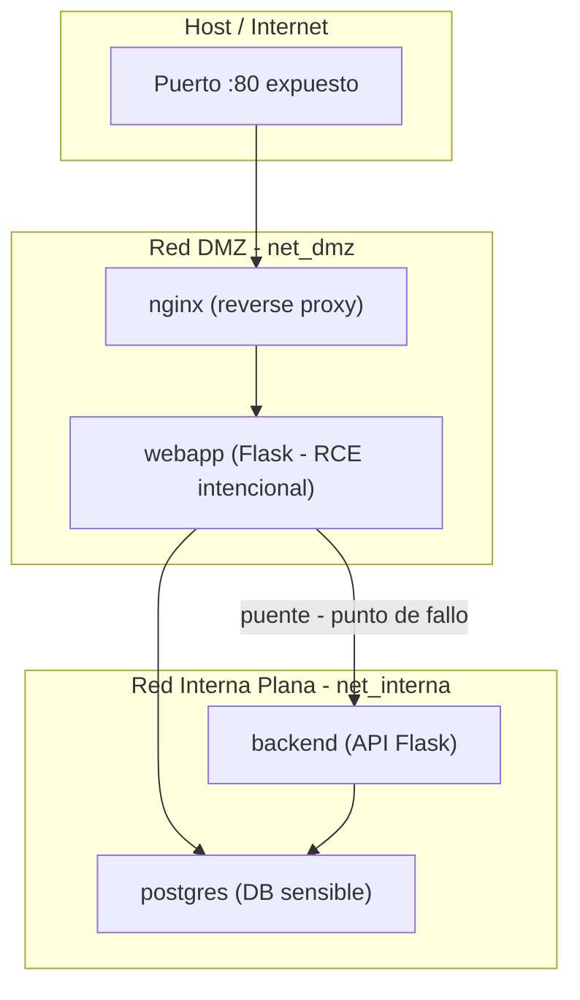

# Plan: Documento de Prototipo Red Perimetral

## Fichero objetivo

[`docs/01_investigacion/Prototipo Red perimetral.md`](docs/01_investigacion/Prototipo Red perimetral.md) — actualmente vacío.

## Estructura del documento a escribir

El documento tendrá estas secciones, en este orden:

### 1. Objetivo del escenario
Breve párrafo situando el Escenario A dentro del TFG: baseline perimetral que se comparará con Zero Trust.

### 2. Modelo de amenaza aplicado
Los 5 puntos del tutor (asunciones del atacante, activos, superficie, amenazas en alcance y fuera de alcance) adaptados a esta arquitectura concreta.

### 3. Arquitectura propuesta

Diagrama Mermaid de la topología con dos redes Docker:



### 4. Decisión de diseño: ¿Por qué dos redes y no una sola?

Explicación de la duda planteada:

- **Opción flat (una red)**: todo en `net_unica`. Es el peor caso teórico, válido pero simplista.
- **Opción DMZ + interna (dos redes)**: representa cómo las organizaciones reales implementan el modelo perimetral. La debilidad no es la ausencia de segmentación, sino que la segmentación se agota en el perímetro. `webapp` actúa de pivot legítimo entre ambas redes.
- Esta opción produce un argumento académico más sólido: *"incluso con DMZ, el modelo perimetral falla"* en lugar de *"sin segmentación hay vulnerabilidad"*.

**Anotación para la memoria (TODO):** Investigar literatura académica sobre DMZ y sus limitaciones en modelos perimetrales (referencias NIST SP 800-207, sección comparativa). Incluir en el capítulo "Estado del Arte" o "Diseño de la Solución" para justificar la elección de arquitectura y reforzar el argumento frente al tribunal.

### 5. Servicios y estructura de ficheros

Tabla de servicios y su rol de seguridad. Estructura de directorios `infra/perimetral/` a crear:

```
infra/
└── perimetral/
    ├── docker-compose.yml
    ├── nginx/
    │   └── nginx.conf
    ├── webapp/
    │   ├── Dockerfile
    │   ├── app.py          ← vulnerabilidad RCE intencional (endpoint /ping)
    │   └── requirements.txt
    ├── backend/
    │   ├── Dockerfile
    │   └── app.py
    └── db/
        └── init.sql        ← datos sensibles de prueba
```

### 6. Esqueleto del docker-compose.yml anotado

Incluir el YAML completo con comentarios de seguridad que explican cada decisión (por qué `webapp` está en dos redes, por qué las credenciales en env vars son un punto débil intencional, etc.).

### 7. Flujo de ataque planificado

Secuencia de pasos del ataque con los comandos concretos a ejecutar desde el contenedor comprometido. Esto es la base del capítulo de Pruebas.

### 8. KPIs a medir

Tabla de métricas comparables entre Escenario A y B: tiempo hasta descubrimiento de DB, servicios accesibles, alertas Wazuh generadas, credenciales recuperables, tráfico cifrado.

### 9. Puntos débiles documentados

Lista de las 6 debilidades estructurales del modelo perimetral que se contrastarán con Zero Trust.

## Lo que NO se incluye en este documento

- Pasos de instalación de Docker (ya en `Apuntes Docker101.md`)
- Configuración de Wazuh (Escenario B)
- Código fuente completo de las aplicaciones (va en `infra/`)
