## 1. Revisión estratégica del objetivo

El objetivo deja de ser "TFG académicamente exhaustivo" y pasa a ser **"TFG entregable el 21/06/2026, defendible, con tesis comparativa demostrada cuantitativamente"**. Esto invierte la jerarquía de decisiones: **redacción > evidencia > implementación nueva**. La parte técnica que no esté lista el 09/06 no puede entrar, porque cada hora posterior es de redacción.

El tutor (correo 09/01/2026) lo pidió literal: *"prepara un primer borrador con los ítems/secciones del TFG y 2–3 frases por sección"*. Es la métrica de "razonablemente decente" que él espera. Hay que **producir ese artefacto antes del 02/06**; sin él, no hay luz verde del tutor a entregar en julio.

## 2. Evaluación realista de viabilidad

**Capacidad efectiva de trabajo:**

- 24/05 → 01/06 (8 días): 1.5h × 6 días útiles ≈ **9-12h efectivas**
- 02/06 → 21/06 (20 días): 12h nominales × 0.75 (fatiga, comidas, imprevistos) ≈ **180h efectivas**
- **Total real: ~190-200h efectivas**

**Carga estimada por bloque (honesta):**

- Esqueleto + borrador para tutor: 8-10h
- Estado del Arte redactado: 25-30h
- Especificación + montaje Escenario B (segmentación + mTLS): 25-35h
- Wazuh mínimo o Falco fallback: 15-25h (con varianza alta)
- Pruebas A/B y cierre KPIs §2/§3: 12-18h
- Redacción Diseño de la Solución (cap. con A y B): 25-30h
- Redacción Pruebas/Resultados: 18-25h
- Redacción Análisis de problemas: 8-12h
- Introducción + Conclusiones + Resumen: 15-20h
- Bibliografía, anexos, figuras, formato Overleaf: 15-20h
- Revisión final + iteración tutor: 10-15h
- Margen para imprevistos: 15-20h

**Total estimado: 191-260h** sobre una capacidad real de ~200h. **El proyecto cabe, pero sin holgura**. Cualquier bloqueo técnico de más de 10h o cualquier iteración profunda con el tutor compromete el deadline.

**Veredicto:** Viable pero apretado. Requiere disciplina absoluta de timeboxing y aceptar el "mínimo viable defendible" en cada bloque.

## 3. Camino crítico del proyecto

```mermaid
flowchart LR
    A[Esqueleto MD<br/>todos los caps<br/>D0-D2] --> B[EdA borrador v0<br/>D3-D6]
    B --> C[Envio tutor<br/>D7 - 01/06]
    C --> D[Spec Escenario B<br/>D9 - 02/06]
    D --> E[Implementacion ZT<br/>D9-D12]
    E --> F[Wazuh minimo o Falco<br/>D13-D14]
    F --> G[Pruebas A/B<br/>D15-D16]
    G --> H[KPIs §2 §3<br/>D17]
    H --> I[Redaccion Diseño + Pruebas<br/>D18-D22]
    I --> J[Intro Conclusiones Resumen<br/>D23-D25]
    J --> K[Overleaf paso final<br/>D26]
    K --> L[Revision + Entrega<br/>D27-D28]
```

El **único nodo con varianza alta** es F (Wazuh). Tiene asociado un criterio de fallback automático: si a las 8h de trabajo neto no hay alertas funcionando, se sustituye por Falco. Esta es la decisión que **protege todo el resto del camino**.

## 3bis. Material preexistente recuperado (24/05 tarde)

Se detectó material en [docs/03_memoria_tfg/Borradores y pretrabajos/](docs/03_memoria_tfg/Borradores%20y%20pretrabajos/) y [docs/01_investigacion/TFG-EstadoDelArte.md](docs/01_investigacion/TFG-EstadoDelArte.md) generado al arrancar el proyecto. Análisis de utilidad:

- **Reutilizable directo:**
  - `Resumen_inicial.md` → copia directa a `00_resumen.md`. Ya validado por el tutor el 09/04/2026 (timeline §11–§12). Ahorra ~1.5h.
  - `Borrador_Funcional_Inicial.md` → semilla del esqueleto de 8 capítulos. Refleja la estructura clásica ETSINF UPV. Ahorra ~1h.
  - `TFG-EstadoDelArte.md` (URL Endesa + nota sobre coste de ciberdelincuencia) → gancho narrativo concreto para el §1.1 Motivación.

- **OBSOLETO — no usar:**
  - `Metricas_iniciales.md` (TTD/profundidad/tasa de bloqueo) fue rechazado por el tutor el 11/03/2026 y reemplazado por las 6 métricas oficiales G1–G3, E1–E3 que ya están en plantilla KPI v2. Si se cuela en la memoria final, el tribunal lo detecta como incoherencia con la propuesta aprobada.

- **Inconsistencia estructural detectada:**
  - El borrador inicial planteaba 8 capítulos ETSINF clásicos (Intro, EdA, Análisis problema, Diseño, Desarrollo, Implantación, Pruebas, Conclusiones). El plan v1 fusionaba a 6. **Decisión: respetar los 8 capítulos** porque (a) es lo que el tribunal de ETSINF UPV espera por defecto, (b) reduce el riesgo de queja estructural y (c) permite ubicar "Desarrollo + Implantación" como capítulo donde se justifica el código (formato anexable). Coste neto: +3-5h de redacción, compensado parcialmente por el ahorro de reutilización.

- **Inconsistencia tecnológica detectada:**
  - El borrador inicial cita **Suricata** como sonda de red. En la decisión actual Suricata es solo fallback de Wazuh. Hay que **justificar explícitamente en Cap. 4 (Diseño)** por qué finalmente se opta por Wazuh y por qué Suricata queda como alternativa documentada. Sin esta justificación, el tribunal puede preguntar "¿qué pasó con Suricata?".

**Impacto neto en viabilidad:** marginal. Probabilidad de éxito sube ligeramente (de 65-70% a 67-72%) por mejor alineación con expectativas del tribunal y reutilización del resumen ya aprobado.

## 4. Replanteamiento del ROADMAP

El ROADMAP de [admin/ROADMAP.md](admin/ROADMAP.md) está pensado para convocatoria de septiembre. Hay que **archivarlo como "v1"** y sustituirlo por un sprint plan de 28 días. Cambios concretos:

- **Eliminar:** "Julio: Redacción Intensiva" y "Agosto-Septiembre: Pulido y Defensa" en lo relativo al deadline del TFG. La defensa oral sigue siendo en julio, pero el TFG se entrega el 21/06.
- **Comprimir:** lo que estaba previsto para "Mayo: Escenario B + Wazuh" + "Junio: Experimento" + "Julio: Redacción" se ejecuta en los 20 días intensivos del 02 al 21/06.
- **Reducir alcance técnico del Escenario B:**
  - Microsegmentación con redes Docker separadas (web_zone / db_zone / mgmt_zone)
  - Identidad de servicio mínima (credenciales no compartidas + variables de entorno por servicio)
  - mTLS entre webapp ↔ backend (single channel, Caddy o Nginx con certs autofirmados generados con OpenSSL)
  - Wazuh manager + agent en `webapp`, con 3-5 reglas custom para los 4 hitos post-RCE de §1.2.b de la plantilla KPI v2
  - **Plan B documentado:** si Wazuh bloquea > 8h netas, sustitución por Falco con reglas YAML equivalentes
- **NO se hace:** automatización Bash/Python avanzada de ataques (mencionada en backlog), ataques de spoofing adicionales, despliegue de Wazuh dashboard custom, métricas más allá de las 6 oficiales (G1-G3, E1-E3).

## 5. Nuevo sistema de prioridades

**Eje de impacto sobre la probabilidad de llegar al 21/06:**

- **P0 — Crítico, no negociable:**
  - Esqueleto completo de la memoria con bullets por sección (entrega al tutor antes del 02/06)
  - Estado del Arte redactado (~10-12 páginas)
  - Escenario B desplegado y comparable contra A en los 6 KPIs
  - Capítulos Diseño + Pruebas + Conclusiones redactados
  - Memoria compilada en Overleaf y revisada
- **P1 — Necesario pero con margen de simplificación:**
  - Wazuh real (vs Falco fallback)
  - mTLS real (vs documentar como "trabajo futuro" si bloquea)
  - Anexos completos
  - Bibliografía con 25+ referencias (vs 15 mínimo defendible)
- **P2 — Sacrificable sin perjuicio sustancial:**
  - Automatización scripts adicionales de ataque
  - Ataques de spoofing añadidos al set original
  - Sesiones de captura adicionales si la del 23/05 ya cierra A
  - Diagramas perfectos (basta con diagramas funcionales hechos en Mermaid o draw.io)
  - Documentación interna en `admin/` y `docs/04_diario_laboratorio/` más allá del mínimo de trazabilidad

## 6. Plan detallado por semanas

### Semana 1 — 24/05 a 31/05 (capacidad 9-12h)

**Objetivo único:** producir el borrador "razonablemente decente" para el tutor.

- 24/05 (dom, 2h): Crear estructura `docs/03_memoria_tfg/` con **9 archivos MD siguiendo ETSINF clásica** (00_resumen, 01_intro, 02_estado_arte, 03_analisis_problema, 04_diseno, 05_desarrollo_implantacion, 06_pruebas, 07_conclusiones, 99_bibliografia). **Reutilizar `Borrador_Funcional_Inicial.md` como semilla** + **copiar `Resumen_inicial.md` literal a `00_resumen.md`**. Marcar `Metricas_iniciales.md` como obsoleto en un README de la carpeta de borradores. Archivar ROADMAP.md como v1.
- 25-27/05 (lun-mié, 4-5h): Redactar Estado del Arte v0 (4-5 páginas) usando el material ya recopilado en [docs/01_investigacion/](docs/01_investigacion/) (Docker101, SSTI, Prototipo Red Perimetral) + bibliografía base sobre NIST 800-207, BeyondCorp, OWASP Top 10, microsegmentación. Incorporar el gancho de coste de ciberdelincuencia + caso Endesa en §1.1 Motivación (no en EdA).
- 28-29/05 (jue-vie, 3h): Esqueleto del Cap. 4 "Diseño" + Cap. 5 "Desarrollo e Implantación" con narrativa A (ya disponible en [docs/04_diario_laboratorio/20260523a_Sesion_Cierre_Baseline_EscenarioA.md](docs/04_diario_laboratorio/20260523a_Sesion_Cierre_Baseline_EscenarioA.md)) + especificación pendiente de B. Incluir justificación explícita Wazuh vs Suricata.
- 30-31/05 (sáb-dom, 2-3h): Envío al tutor el domingo 31/05 por la tarde con (1) índice de 8 capítulos ETSINF, (2) Estado del Arte v0, (3) plan de cierre técnico, (4) preguntar si el enfoque le parece "razonablemente decente" para arrancar la fase intensiva.

### Semana 2 — 01/06 a 07/06 (capacidad ~80h, fase intensiva arranca el 02/06)

**Objetivo único:** Escenario B funcional con segmentación + identidad + mTLS + observabilidad.

- 01/06 (lun, 2h): Especificación detallada Escenario B en MD. Definir reglas exactas que deben dispararse para cubrir G1, G3.
- 02-03/06 (mar-mié, 24h): Implementar `infra/zero_trust/` con docker-compose de 3 redes, separación de roles, certs OpenSSL para mTLS, configuración Caddy/Nginx.
- 04/06 (jue, 12h): Wazuh mínimo (manager + agent en webapp). **Checkpoint a las 8h netas:** si no hay agent enrollado y al menos 1 alerta funcionando, switch a Falco.
- 05/06 (vie, 12h): Reglas custom para los 4 hitos post-RCE (lectura de creds, escaneo interno, curl a backend, psql a db). Documentar cada regla.
- 06-07/06 (sáb-dom, 24h): Pruebas A/B post-RCE replicando exactamente el protocolo del 23/05. Capturar logs equivalentes, generar `tests/logs/zerotrust_sesion_YYYYMMDD_HHMMSS/`. Comprobar que los 4 hitos están **detectados** o **bloqueados** según corresponda.

### Semana 3 — 08/06 a 14/06 (capacidad ~80h)

**Objetivo único:** comparativa cerrada + 60% de la memoria redactada.

- 08/06 (lun, 12h): Cerrar plantilla KPI v2 §2 (Escenario B) y §3 (comparativa A vs B). Si algún KPI no salió como se esperaba, documentar y razonar.
- 09/06 (mar, 12h): Redactar Cap. 3 "Diseño de la Solución" completo. Subsección A (a partir de los diarios), subsección B (a partir de la spec + commit del repo). Justificar decisiones (criterio del tutor).
- 10-11/06 (mié-jue, 24h): Redactar Cap. 4 "Pruebas y Resultados". Tablas KPI, capturas de pantalla, comparativa cuantitativa. **Este es el corazón del TFG y donde más nota se juega.**
- 12-13/06 (vie-sáb, 24h): Redactar Cap. 5 "Análisis de Problemas" (cuello de botella habitual en TFGs: usar los diarios de laboratorio del 04, 05, 09 y 12 de mayo). Sin esto, perdemos puntos de "reflexión crítica".
- 14/06 (dom, 8h): Checkpoint completo. Revisar qué falta. Email al tutor con "tengo capítulos 2, 3, 4 y 5 en borrador avanzado, ¿quieres revisión parcial o esperas al draft completo?".

### Semana 4 — 15/06 a 21/06 (capacidad ~70h)

**Objetivo único:** memoria compilada, revisada y entregada.

- 15/06 (lun, 12h): Cap. 1 "Introducción" + objetivos + estructura. Resumen ejecutivo (abstract).
- 16/06 (mar, 12h): Cap. 6 "Conclusiones" + trabajo futuro (aquí va lo que no se implementó: ataques de spoofing, escalado real, despliegue Kubernetes, etc.).
- 17/06 (mié, 12h): Setup proyecto Overleaf con plantilla ETSINF UPV. Transferir EdA + Cap 3 + Cap 4 desde MD. Configurar bibliografía BibTeX (Zotero export o manual).
- 18/06 (jue, 12h): Transferir resto de capítulos. Maquetar figuras, tablas, código. Resolver errores LaTeX.
- 19/06 (vie, 12h): Revisión completa pasada 1: ortografía, coherencia narrativa, citas, referencias cruzadas. Email al tutor con PDF final.
- 20/06 (sáb, 10h): Incorporar correcciones del tutor. Revisión pasada 2. Validar índices, paginación, formato ETSINF.
- 21/06 (dom, 6h): Revisión pasada 3, generación PDF final, depósito en plataforma. **Buffer reservado de 4-5h por imprevistos finales.**

## 7. Plan detallado por días críticos

**Día 1 — 24/05 (hoy):** Crear `docs/03_memoria_tfg/` con 7 archivos: `00_resumen.md`, `01_introduccion.md`, `02_estado_arte.md`, `03_diseño_solucion.md`, `04_pruebas.md`, `05_analisis_problemas.md`, `06_conclusiones.md`, `99_bibliografia.md`. Cada uno con índice de secciones y 2-3 frases por sección. Archivar ROADMAP.md como `ROADMAP_v1.md` y crear `ROADMAP_v2_sprint_final.md` con este plan.

**Día 8 — 31/05 (envío al tutor):** Email con texto corto: "Adjunto borrador inicial del índice y Estado del Arte v0, plan detallado de las últimas 3 semanas y propuesta de alcance del Escenario B. ¿Es 'razonablemente decente' para arrancar el sprint final? ¿Hay algún ajuste que ves crítico antes de entrar en fase intensiva?".

**Día 12 — 04/06 (checkpoint Wazuh):** Decisión binaria a las 20:00. Si Wazuh manager + agent + 1 alerta funcionando = continuar. Si no = `git checkout` de la rama Wazuh, crear rama Falco, redesplegar en 3-4h.

**Día 17 — 09/06:** Cap. 3 cerrado en borrador. Si no está, hay que **sacrificar profundidad de algún subapartado** y avanzar. No se reabre.

**Día 24 — 16/06:** Si el draft no está al 80%, **se reduce extensión** del Cap. 5 (Análisis de Problemas) y se llevan secciones a anexos.

**Día 27 — 19/06:** PDF al tutor con margen de 36h para correcciones. Si el tutor está en vacaciones o no responde, **se entrega con la última versión propia**.

## 8. Riesgos principales y mitigaciones

- **R1: Wazuh bloquea > 8h.** Probabilidad: 35%. Impacto: pierde 1-2 días si no se mitiga. **Mitigación:** criterio de fallback automático a Falco con timestamp duro (04/06 20:00). Decisión documentada en `admin/DECISIONS_LOG.md` con ADR.
- **R2: mTLS bloquea > 4h.** Probabilidad: 30%. Impacto: pierde medio día. **Mitigación:** si bloquea, documentar como "trabajo futuro" en Cap. 6 y mantener segmentación pura como contraste vs A. La tesis sigue defendible.
- **R3: Tutor no responde al envío del 31/05 en 5+ días.** Probabilidad: 50% (cadencia habitual 1-3 semanas según [docs/02_reuniones_tutor/00_DIRECTRICES_TUTOR.md §6](docs/02_reuniones_tutor/00_DIRECTRICES_TUTOR.md)). Impacto: avanzar a ciegas sin validación de enfoque. **Mitigación:** no bloquear. El borrador se envía y el sprint arranca el 02/06 igualmente. Cualquier feedback que llegue después se incorpora como ajuste, no como rediseño.
- **R4: Sobrecoste de redacción.** Probabilidad: 60% (los TFGs siempre se redactan en más tiempo del estimado). Impacto: hasta 30h. **Mitigación:** los 15-20h de buffer + el orden de redacción (lo crítico primero, lo simplificable al final).
- **R5: Bug Docker irreproducible en el Escenario B.** Probabilidad: 25%. Impacto: hasta 1 día. **Mitigación:** timeboxing duro de 2h por problema (regla del [admin/ROADMAP.md](admin/ROADMAP.md) original), después se simplifica el componente afectado.
- **R6: Overleaf/plantilla LaTeX da errores el día 17.** Probabilidad: 30%. Impacto: hasta 6h. **Mitigación:** crear el proyecto Overleaf **el 14/06** (un día simbólico de "preparar terreno"), no el 17. Verificar que compila con texto dummy antes de transferir contenido real.
- **R7: Pau enferma o tiene imprevisto personal.** Probabilidad: 15%. Impacto: 1-3 días. **Mitigación:** el buffer total del plan absorbe hasta 2 días perdidos. Más allá, hay que solicitar al tutor convocatoria de septiembre como red de seguridad antes del 15/06.

## 9. Estrategia de interacción con el tutor

- **Envío 1 — 31/05 (domingo tarde):** "Plan + Estado del Arte v0 + propuesta de alcance Escenario B reducido". Objetivo: obtener el "OK seguimos" mencionado por el tutor en su respuesta.
- **Envío 2 — 14/06 (domingo tarde):** "Memoria al 60% (Estado del Arte completo, Diseño completo, Pruebas en borrador con tablas comparativas)". Objetivo: validar el corazón cuantitativo del TFG.
- **Envío 3 — 19/06 (viernes tarde):** "PDF compilado completo en Overleaf". Objetivo: dar al tutor 48h reales para correcciones finales.
- **Comunicación de riesgo:** si en algún envío el tutor responde "esto no llega", entonces el 15/06 es el último día para activar la convocatoria de septiembre como Plan B.
- **Formato de cada envío:** breve, con bullets claros de qué se entrega, qué se pide, y qué se hará por defecto si no responde. No usar lenguaje dubitativo.

## 10. Estrategia de redacción acelerada

**Orden óptimo de escritura (refinado, estructura ETSINF 8 caps):**

1. **Esqueletos de los 8 capítulos (D0-D2):** sin profundidad, solo índice + 2-3 frases. Reutilizar `Borrador_Funcional_Inicial.md` como semilla.
2. **Cap. 2 Estado del Arte (D3-D6):** primero porque es independiente del laboratorio. Usar [docs/01_investigacion/](docs/01_investigacion/) como insumo. ~10-12 páginas.
3. **Cap. 3 Análisis del Problema (D9):** modelo de amenazas v2 (ya validado), requisitos funcionales y no funcionales. Apoyarse en [docs/02_reuniones_tutor/00_DIRECTRICES_TUTOR.md §3](docs/02_reuniones_tutor/00_DIRECTRICES_TUTOR.md).
4. **Cap. 4 Diseño de la Solución (D10):** arquitecturas A y B en alto nivel. Tecnología elegida y justificada (Docker, Wazuh, mTLS). Justificar Wazuh vs Suricata aquí.
5. **Cap. 5 Desarrollo e Implantación (D11):** ya está casi escrito en los diarios. Copiar, filtrar lo relevante (criterio tutor §1-§2) y reorganizar. Configs extensas → anexos.
6. **Cap. 6 Pruebas (D12-D13):** corazón del TFG, máxima nota. Tablas KPI v2 §3 + capturas + interpretación cuantitativa.
7. **Cap. 7 Conclusiones (D16):** se escribe después de tener todo lo cuantitativo. Incluir "Trabajo futuro" con lo no implementado (Suricata, K8s, ataques adicionales).
8. **Cap. 1 Introducción (D15):** se escribe penúltima. Incorporar el gancho Endesa + coste creciente de ciberdelincuencia recogido en [docs/01_investigacion/TFG-EstadoDelArte.md](docs/01_investigacion/TFG-EstadoDelArte.md) como párrafo de motivación.
9. **00 Resumen / abstract (D15):** copia directa de `Resumen_inicial.md` con retoques cosméticos. Ya está aprobado por el tutor (09/04/2026).

**Tácticas anti-bloqueo de redacción:**

- **Plantilla por capítulo:** cada capítulo arranca con un párrafo "esta sección presenta X, Y, Z" + bullets + cierre. Si te bloqueas en un párrafo, mete TODO en bullets, sigue, y reescribe los bullets como prosa al final.
- **Citar mientras escribes, no después:** cada vez que pegas un dato técnico, mete `[CITAR: NIST 800-207 §X.Y]` en línea. Al final pasas todo el archivo y conviertes los marcadores en BibTeX. Evita el bloqueo "tengo que buscar dónde leí esto".
- **Figuras y tablas con placeholder:** mete `[FIG: diagrama redes ZT]` en línea. Las figuras se hacen en bloque el 18/06 (ahorra contexto-switch).
- **Iteración por timeboxing duro:** 50 min Pomodoro, 10 min descanso. Cada Pomodoro tiene un objetivo concreto (no "trabajar en cap 3" sino "terminar §3.2.1").
- **Lectura del tutor:** la directriz §1 del [docs/02_reuniones_tutor/00_DIRECTRICES_TUTOR.md](docs/02_reuniones_tutor/00_DIRECTRICES_TUTOR.md) es **"Análisis de Seguridad, NO manual de Arquitectura"**. Aplicar el filtro en cada párrafo técnico: si describe cómo se monta y no por qué/qué se ataca/qué se mide → va a anexo o se borra.

## 11. Qué eliminar, simplificar o posponer

**Eliminar del backlog actual (no aporta a la nota en este timeframe):**

- T17 "Protocolo de pruebas A/B" como documento separado → se integra directamente en el Cap. 4 redactado.
- Automatización avanzada de ataques con scripts.
- Sesiones adicionales de captura en Escenario A. La del 23/05 es la oficial.
- Refinamiento de plantillas v2 → v3.

**Simplificar:**

- Wazuh: solo manager + 1 agent + 3-5 reglas. No dashboard custom, no integración email/Slack.
- mTLS: solo entre webapp ↔ backend, no en todo el stack. Documentar el resto como trabajo futuro.
- Bibliografía: 15-25 referencias bien elegidas (NIST 800-207, BeyondCorp, OWASP, CIS, papers IEEE puntuales) > 50 superficiales.
- Diagramas: Mermaid embebido o draw.io rápido. No invertir tiempo en diagramas perfectos hasta el día 18/06.

**Posponer a "Trabajo Futuro" (Cap. 6):**

- Despliegue real en Kubernetes / cloud.
- Ampliación a otros vectores (spoofing avanzado, DoS, ataques DNS).
- IDS/IPS adicionales más allá de Wazuh/Falco.
- Escalado a múltiples agentes Wazuh.
- Reglas avanzadas de NetworkPolicy.

## 12. Condiciones mínimas necesarias para llegar

Estas son las **condiciones AND**: si falla una, la entrega del 21/06 está en serio peligro.

1. Borrador "razonablemente decente" enviado al tutor antes del 02/06 con respuesta positiva o sin respuesta (no respuesta crítica).
2. Wazuh o Falco produciendo al menos 3 alertas distintas en el Escenario B antes del 09/06.
3. Plantilla KPI v2 §2 y §3 con valores reales antes del 10/06.
4. Capítulos 3 y 4 en borrador antes del 14/06.
5. PDF completo en Overleaf antes del 19/06.
6. Sin enfermedad ni imprevisto familiar grave en el periodo 02-21/06.
7. Disciplina absoluta con timeboxing: ningún componente técnico puede exceder su presupuesto en más del 30% sin activar fallback.

## 13. Probabilidad estimada de éxito

**Estimación honesta:**

- Si se respetan estrictamente todas las condiciones del §12: **65-70%**.
- Si se activa Plan B (Falco vs Wazuh): **55-60%**.
- Si el tutor no responde al envío del 31/05 hasta el 10/06: baja a **45-55%**.
- Si Pau pierde 2+ días por imprevisto personal: cae a **30-40%**.

**El plan no garantiza llegar.** Lo que garantiza es **maximizar la probabilidad bajo las restricciones dadas**. El factor con mayor peso negativo es el solapamiento entre implementación de Escenario B y arranque de redacción intensiva. El factor con mayor peso positivo es que el Escenario A está cerrado y los KPIs están definidos.

**Recomendación honesta:** mantener identificado un Plan C (convocatoria de septiembre) hasta el 12/06. Si el 12/06 el Escenario B no está funcional, no se podrá llegar al 21/06 con calidad defendible y conviene reasignar el plan a septiembre antes de quemar las 50h finales en una entrega comprometida.

## 14. Próximos pasos inmediatos (próximas 48h)

Las próximas 48h (24/05 y 25/05) deben dedicarse exclusivamente a producir el esqueleto + arranque del Estado del Arte. **No tocar código del Escenario B**. Las tareas concretas están listadas en los todos.