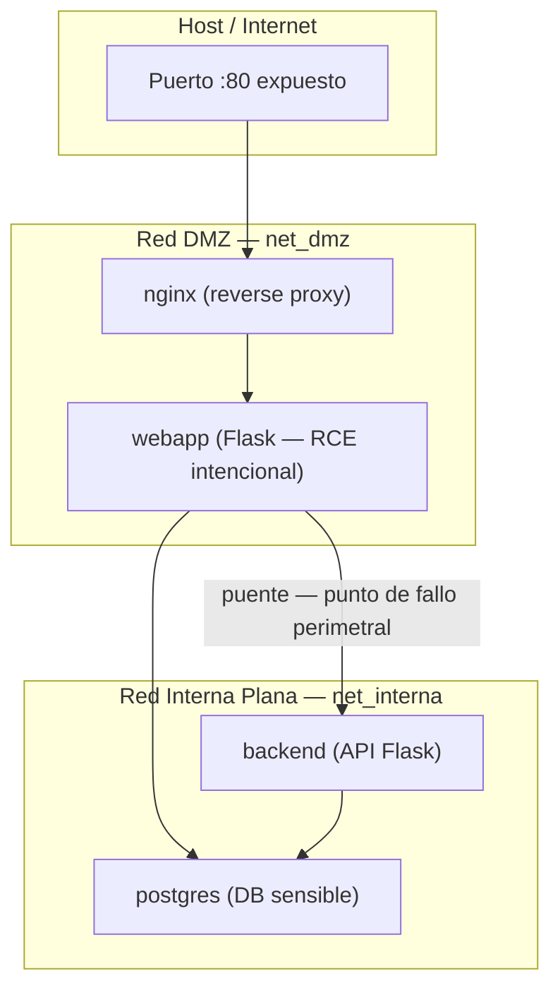

# Prototipo: Red Perimetral (Escenario A)

> **Documento de referencia técnica** para la implementación del Escenario A del TFG.
> Este documento recoge el diseño, las decisiones arquitectónicas y el flujo de ataque planificado.
> El código fuente real de la infraestructura vive en `infra/perimetral/`.

---

## 1. Objetivo del escenario

El Escenario A constituye el **baseline perimetral** del TFG. Su propósito no es demostrar una arquitectura segura, sino reproducir fielmente el modelo "castillo y foso" que históricamente ha dominado la seguridad en redes corporativas, y exponer de forma medible sus limitaciones.

Los resultados obtenidos en este escenario (tiempos, accesos, alertas) serán la referencia directa con la que se comparará el Escenario B (Zero Trust). Sin un baseline sólido y reproducible, la comparativa carece de validez académica.

---

## 2. Modelo de amenaza aplicado

Siguiendo el marco definido por el tutor, el modelo de amenaza de este escenario es:

| Elemento | Definición |
|---|---|
| **Asunciones del atacante** | Atacante externo, no privilegiado, con ejecución de código remota (RCE) obtenida en el servicio web. Sin acceso físico ni credenciales de administración de red. |
| **Activos a proteger** | Base de datos PostgreSQL con datos sensibles de prueba y variables de entorno del backend (ficheros `.env` / variables de entorno del sistema). |
| **Superficie de estudio** | Red interna de contenedores Docker. |
| **Amenazas en alcance** | Movimiento lateral entre contenedores, interceptación de tráfico interno, exfiltración de datos de la base de datos. |
| **Amenazas fuera de alcance** | Ingeniería social, seguridad física, vulnerabilidades del kernel del host. |

El punto de entrada del atacante es siempre el mismo: **RCE en `webapp`** a través de un endpoint intencionalmente vulnerable. Todo el análisis parte de esa asunción de compromiso inicial.

---

## 3. Arquitectura propuesta

### 3.1 Topología lógica



### 3.2 Descripción de servicios

| Servicio | Imagen base | Redes | Rol de seguridad |
|---|---|---|---|
| `nginx` | `nginx:alpine` | `net_dmz` | Único punto de entrada desde el host. Define el perímetro. |
| `webapp` | `python:3.11-slim` | `net_dmz` + `net_interna` | Aplicación web con vulnerabilidad RCE intencional. **Es el pivot del ataque.** |
| `backend` | `python:3.11-slim` | `net_interna` | API interna. Superficie de movimiento lateral desde `webapp`. |
| `db` | `postgres:15-alpine` | `net_interna` | Activo principal a proteger. Contiene datos sensibles de prueba. |
| `attacker` | `kalilinux/kali-rolling` | `net_dmz` | Contenedor de ataque. Solo se levanta en modo `--profile attack`. |

---

## 4. Decisión de diseño: ¿Por qué dos redes y no una sola?

### La duda

Durante el diseño surgió la pregunta: si esto es un modelo perimetral "plano", ¿no debería todo estar en la misma red Docker?

### La respuesta

Ambas opciones son válidas, pero tienen implicaciones académicas distintas:

**Opción A — Red única (`net_unica`)**
Todo en una sola red Docker. Solo `nginx` tiene puerto expuesto al host. Es el peor caso teórico: una vez dentro, visibilidad total. Válido, pero el argumento resultante es débil: *"si no hay segmentación, hay vulnerabilidad"*. Cualquier tribunal esperaría eso.

**Opción B — Dos redes (DMZ + interna)** ← *Opción elegida*
Representa cómo las organizaciones reales implementan el modelo perimetral. La empresa tiene un firewall exterior, una DMZ con los servidores web, y una red interna "protegida" con la base de datos. La debilidad no es la ausencia total de segmentación, sino que **la segmentación se agota en el perímetro**. `webapp` actúa de pivot legítimo (tiene acceso a ambas redes por diseño), y ese acceso no está controlado internamente.

El argumento académico que produce es más sólido: *"incluso con una arquitectura DMZ estándar de la industria, el modelo perimetral falla porque no hay controles de autenticación ni microsegmentación dentro del perímetro"*. Este argumento conecta directamente con la justificación de Zero Trust.

> **TODO — Investigación para la memoria:**
> Buscar literatura académica y referencias normativas sobre las limitaciones del modelo DMZ en arquitecturas perimetrales.
> Referencias candidatas: NIST SP 800-207 (sección comparativa perimetral vs. ZTA), John Kindervag (origen Zero Trust), Forrester Research (2010).
> Incluir en el capítulo **"Estado del Arte"** para justificar la elección de esta arquitectura de dos redes y reforzar el argumento ante el tribunal: la implementación reproduce fielmente la práctica estándar, no un caso extremo fabricado.

---

## 5. Estructura de ficheros

```
infra/
└── perimetral/
    ├── docker-compose.yml          ← Orquestación completa del escenario
    ├── nginx/
    │   └── nginx.conf              ← Configuración del reverse proxy
    ├── webapp/
    │   ├── Dockerfile
    │   ├── app.py                  ← Vulnerabilidad RCE intencional (endpoint /ping)
    │   └── requirements.txt
    ├── backend/
    │   ├── Dockerfile
    │   └── app.py                  ← API interna sin autenticación (punto débil intencional)
    └── db/
        └── init.sql                ← Esquema y datos sensibles de prueba
```

---

## 6. Esqueleto del `docker-compose.yml`

```yaml
version: "3.9"

services:

  nginx:
    image: nginx:alpine
    ports:
      - "80:80"                     # ÚNICO puerto expuesto al host — define el perímetro
    volumes:
      - ./nginx/nginx.conf:/etc/nginx/nginx.conf:ro
    networks:
      - net_dmz
    depends_on:
      - webapp

  webapp:
    build: ./webapp
    networks:
      - net_dmz                     # Visible desde nginx (DMZ)
      - net_interna                 # PUENTE hacia la red interna — este es el fallo del modelo perimetral:
                                    # webapp tiene acceso legítimo a ambas redes, y ese acceso
                                    # no está autenticado ni monitorizado internamente.
    environment:
      - DB_HOST=db
      - DB_PASSWORD=supersecret     # PUNTO DÉBIL INTENCIONAL: credencial en texto plano.
                                    # Un atacante con RCE puede leerla con `env | grep PASSWORD`.
    depends_on:
      - db

  backend:
    build: ./backend
    networks:
      - net_interna                 # Solo accesible desde la red interna — no hay firewall
                                    # que impida a webapp contactar con backend libremente.
    environment:
      - DB_HOST=db
      - DB_PASSWORD=supersecret

  db:
    image: postgres:15-alpine
    networks:
      - net_interna                 # Solo en red interna, pero webapp puede llegar aquí
                                    # sin ningún control adicional tras comprometer el perímetro.
    environment:
      - POSTGRES_PASSWORD=supersecret
      - POSTGRES_DB=empresa_db
    volumes:
      - ./db/init.sql:/docker-entrypoint-initdb.d/init.sql

  attacker:
    image: kalilinux/kali-rolling
    networks:
      - net_dmz                     # Simula presencia del atacante en la DMZ tras compromiso inicial
    command: sleep infinity
    profiles:
      - attack                      # Solo se levanta con: docker compose --profile attack up -d attacker

networks:
  net_dmz:
    driver: bridge
  net_interna:
    driver: bridge
```

---

## 7. Flujo de ataque planificado

El ataque sigue la secuencia de post-explotación definida en el modelo de amenaza. El punto de partida es siempre RCE ya obtenida en `webapp`.

### Paso 1 — Reconocimiento de red interna

Desde `webapp` comprometida, el atacante descubre qué hosts existen en `net_interna`:

```bash
# Desde dentro del contenedor webapp (vía RCE o docker exec en la demo)
nmap -sn 172.20.0.0/24
```

**Qué demuestra:** `webapp` tiene visibilidad completa de `net_interna`. No hay ningún control que lo impida.

### Paso 2 — Identificación de servicios

```bash
nmap -sV 172.20.0.3    # Fingerprint del servicio en la IP de db
```

**Qué demuestra:** El atacante identifica PostgreSQL en el puerto 5432 sin credenciales ni autenticación de red.

### Paso 3 — Exfiltración de credenciales

```bash
env | grep -i password    # Lee las variables de entorno del proceso webapp
cat /proc/1/environ | tr '\0' '\n' | grep -i password
```

**Qué demuestra:** Las credenciales de la base de datos están accesibles en texto plano para cualquier proceso con RCE en el contenedor.

### Paso 4 — Acceso directo a la base de datos

```bash
psql -h db -U postgres -d empresa_db -c "SELECT * FROM usuarios;"
```

**Qué demuestra:** Con las credenciales obtenidas en el paso anterior, el atacante accede a los datos sensibles en un único salto desde `webapp`.

### Paso 5 — Movimiento lateral a `backend`

```bash
curl http://backend:5000/api/datos
```

**Qué demuestra:** El atacante puede contactar con otros servicios internos sin ningún control de autenticación entre ellos.

### Paso 6 — Captura de tráfico interno (opcional)

```bash
# Desde un contenedor en la misma red
tcpdump -i eth0 -w /tmp/captura.pcap
```

**Qué demuestra:** El tráfico entre `webapp`, `backend` y `db` circula en texto claro. No hay cifrado en las comunicaciones internas.

---

## 8. KPIs a medir

Estas métricas deben registrarse durante la ejecución del ataque. Son comparables directamente con los resultados del Escenario B (Zero Trust).

| Métrica | Escenario A (Perimetral) | Escenario B (Zero Trust) |
|---|---|---|
| Tiempo hasta descubrimiento de `db` tras RCE | _por medir_ | _por medir_ |
| Número de servicios accesibles desde `webapp` comprometida | _por medir_ | _por medir_ |
| Credenciales recuperables sin privilegios adicionales | Sí (`env`) | _por medir_ |
| Tráfico interno circula en claro | Sí | _por medir_ |
| Alertas generadas en Wazuh durante el ataque completo | _por medir_ | _por medir_ |
| Número de saltos hasta exfiltrar datos de `db` | 1 (webapp → db) | _por medir_ |

---

## 9. Puntos débiles estructurales documentados

Estos son los fallos del modelo perimetral que este escenario expone de forma medible. Cada uno tiene su contrapartida en Zero Trust.

1. **Confianza implícita interna.** Dentro de `net_interna`, todos los contenedores se tratan como entidades de confianza por defecto. No existe autenticación entre servicios: `webapp` puede hablar con `db` sin presentar ninguna identidad.

2. **Segmentación agotada en el perímetro.** La única barrera real es `nginx` en el borde. Una vez comprometida `webapp`, el atacante hereda todo el acceso legítimo de ese servicio a la red interna. No hay defensa en profundidad.

3. **Movimiento lateral sin fricción.** El atacante recorre el camino `webapp → db` en un único salto, sin que ningún control lo detecte ni lo bloquee en tránsito.

4. **Credenciales en texto plano.** Las variables de entorno con contraseñas de base de datos son accesibles para cualquier proceso dentro del contenedor, incluyendo un atacante con RCE.

5. **Tráfico interno no cifrado.** Las comunicaciones entre `webapp`, `backend` y `db` circulan en claro. Un atacante con acceso a la red puede interceptarlas y leerlas sin descifrado (`tcpdump`).

6. **Perímetro como único control de seguridad.** El modelo deposita toda la confianza en un único punto de control. Cualquier vulnerabilidad en `webapp` lo anula completamente, sin que exista ninguna capa adicional que contenga el daño.
