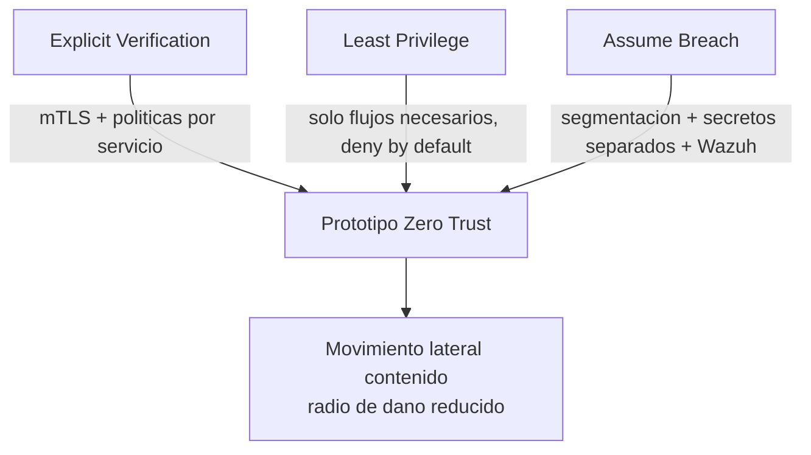
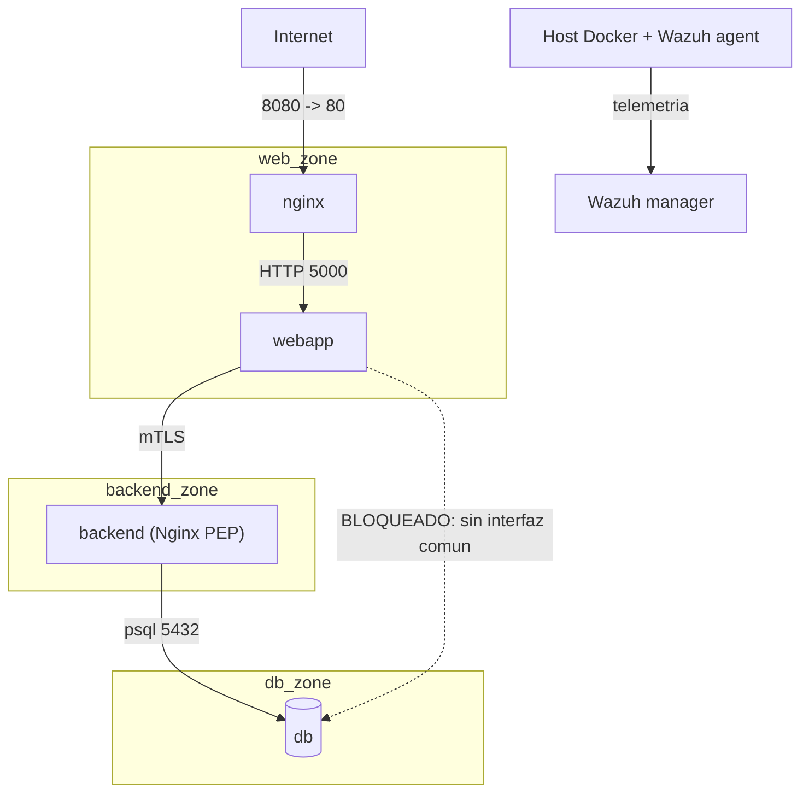
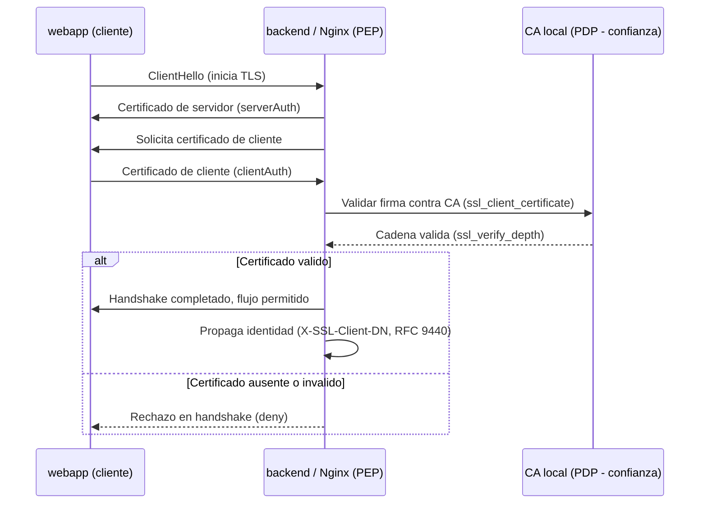
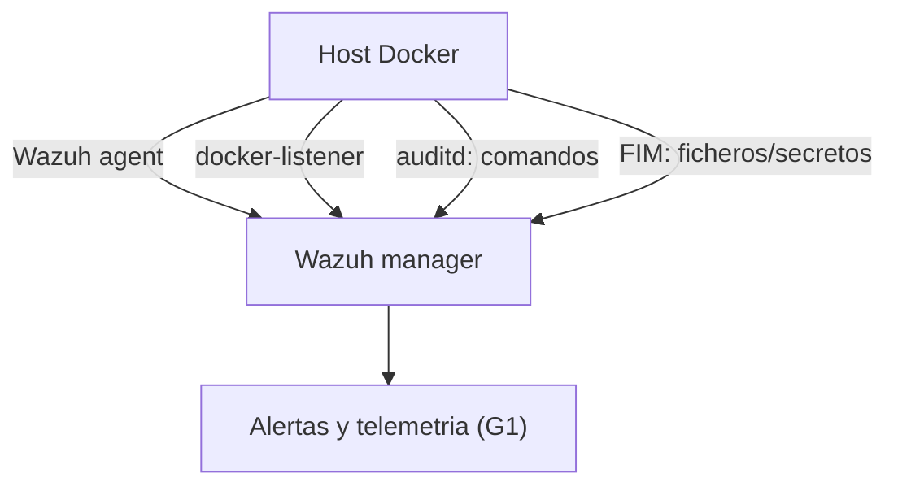
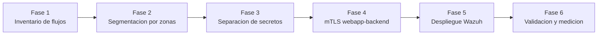

# Prototipo de Red Zero Trust

> **Fecha:** 2026-06-03
> **Propósito:** Traducir la investigación consolidada en `Investigacion_ZeroTrust.md` a una arquitectura Zero Trust concreta e implementable para el Escenario B del TFG.
> **Regla de trazabilidad:** toda decisión arquitectónica de este documento se rastrea a una sección de [`Investigacion_ZeroTrust.md`](Investigacion_ZeroTrust.md). No se introducen tecnologías, patrones ni controles ausentes en la investigación. Donde falte información del proyecto, se documenta como limitación en lugar de inventarla (ver §12).
> **Capacidades base (de la investigación):** microsegmentación · identidad de servicio mediante mTLS · observabilidad y detección con Wazuh.
> **Principios base (de la investigación):** Explicit Verification · Least Privilege · Assume Breach.

---

## 1. Resumen Ejecutivo

> Fuente: `Investigacion_ZeroTrust.md` — "Resumen Ejecutivo" y "¿Qué es Zero Trust?".

### Objetivo del diseño

Diseñar una arquitectura de contenedores Docker organizada en tres zonas funcionales (`web_zone`, `backend_zone`, `db_zone`) que elimine la confianza implícita de la red interna, de modo que **proteja recursos en lugar del perímetro**. El prototipo aplica las tres palancas mutuamente reforzantes que la investigación identifica como las más efectivas: microsegmentación de red, identidad de servicio con mTLS y detección host-based con Wazuh.

### Problemas que resuelve

El Escenario A (red plana perimetral) presenta confianza implícita total una vez dentro de la red interna. Esto habilita, tras un RCE en `webapp`, la cadena documentada en el baseline: lectura de credenciales compartidas, movimiento lateral a `backend`, tráfico en claro y volcado de `db`. El prototipo ataca directamente esas debilidades:

- La red plana permite movimiento lateral libre → **microsegmentación con denegación por defecto**.
- El tráfico este-oeste va en claro y sin autenticar → **mTLS entre servicios**.
- No existe detección activa → **observabilidad con Wazuh bajo "assume breach"**.

### Beneficios esperados frente a una red plana

| Dimensión | Red plana (Escenario A) | Prototipo Zero Trust (Escenario B) |
|---|---|---|
| Unidad protegida | La red (el borde) | El recurso individual |
| Movimiento lateral | Fácil tras una intrusión | Fuertemente contenido |
| Tráfico interno | Texto claro | Cifrado y autenticado (mTLS) |
| Detección | Inexistente | Activa (Wazuh host-based) |
| Alcance de una brecha | Amplio | Radio de daño reducido |

La conclusión transversal de la investigación se mantiene como tesis del prototipo: **segmentación + control de secretos + TLS/mTLS** son las defensas más consistentes contra reconocimiento, robo de claves, exfiltración y movimiento lateral en contenedores.

---

## 2. Mapeo de Principios Zero Trust

> Fuente: `Investigacion_ZeroTrust.md` — "Principios Fundamentales".

### Explicit Verification

**Cómo se implementa:** cada petición entre componentes se autentica y autoriza antes de permitir el flujo. En el prototipo, el canal crítico `webapp → backend` exige **mTLS**: el cliente presenta certificado válido firmado por la CA local y el servidor lo verifica en el handshake. La conectividad de red deja de ser identidad.

**Controles que participan:**
- mTLS terminado en Nginx (`ssl_verify_client on`) — actúa como punto de aplicación (PEP).
- Políticas de red por servicio (asignación selectiva de zonas) — definen qué flujos están permitidos (PDP).
- Cabeceras de identidad de cliente hacia el backend (RFC 9440) para propagar el sujeto verificado.

### Least Privilege

**Accesos que se permiten** (flujos mínimos necesarios, derivados del inventario de §10 Fase 1):
- `nginx → webapp` (único punto de entrada externo a la aplicación).
- `webapp → backend` (consumo de la API interna, bajo mTLS).
- `backend → db` (acceso a datos, único servicio autorizado).

**Accesos que se bloquean:**
- `webapp → db` directamente (no es funcionalmente necesario; `webapp` no debe tener interfaz en `db_zone`).
- Cualquier flujo no enumerado explícitamente (**denegación por defecto**).

NIST prescribe acceso por sesión y con privilegios mínimos: cada zona solo alcanza los puertos concretos de la zona contigua.

### Assume Breach

**Qué ocurriría si `web_zone` fuera comprometida:** se diseña dando por hecho que `webapp` ya está bajo control del atacante (es exactamente el modelo de amenazas del TFG: RCE en `webapp`).

**Cómo se limita el impacto:**
- La segmentación impide el salto directo a `db_zone` (sin interfaz compartida → sin ruta L3).
- La separación de secretos evita que comprometer `webapp` exponga las credenciales de `db` (§7).
- mTLS impide la interceptación e impide suplantar al backend sin el certificado correcto.
- Wazuh genera telemetría desde el host para detectar el comportamiento post-RCE (§8).

---

## 3. Arquitectura Objetivo

> Fuente: `Investigacion_ZeroTrust.md` — "Componentes de una Arquitectura Zero Trust" y "Segmentación y Microsegmentación".

### Componentes y su rol ZTA

| Componente conceptual (NIST) | Realización en el prototipo |
|---|---|
| Punto de decisión de políticas (PDP) | Reglas de red por zona + configuración mTLS de Nginx |
| Punto de aplicación de políticas (PEP) | Nginx (`ssl_verify_client`) + aislamiento de redes Docker |
| Identidad de servicio | Certificados cliente/servidor firmados por CA local |
| Telemetría / monitorización continua | Wazuh agent en el host (auditd, FIM, docker-listener) |
| Zonas funcionales | `web_zone`, `backend_zone`, `db_zone` |

### Zonas, servicios y dependencias

- **`web_zone`** — zona de exposición controlada: `nginx` (punto de entrada externo) y `webapp`.
- **`backend_zone`** — zona de lógica interna con acceso restringido: `webapp` (como cliente) y `backend` (como servidor mTLS).
- **`db_zone`** — zona crítica con flujos mínimos: `backend` y `db`.

`webapp` es multihomed entre `web_zone` y `backend_zone`; `backend` es multihomed entre `backend_zone` y `db_zone`. Ningún servicio tiene interfaz en las tres zonas, lo que rompe la cadena directa `webapp → db`.

---

## 4. Diseño de Segmentación

> Fuente: `Investigacion_ZeroTrust.md` — "Segmentación y Microsegmentación" (regla: si comprometer A no debe dar acceso a B, A y B van en segmentos distintos).

### `web_zone`

- **Recursos contenidos:** `nginx`, `webapp`.
- **Nivel de criticidad:** medio (es la superficie de ataque expuesta; `webapp` es el punto de entrada del RCE).
- **Accesos permitidos:** entrada externa a `nginx` (8080→80); `nginx → webapp` (5000).
- **Accesos denegados:** acceso directo desde `web_zone` a `db_zone`.
- **Justificación:** la zona expuesta debe poder ser comprometida sin que ello implique alcance a los datos. Es la aplicación directa de "assume breach" y de la contención del movimiento lateral.

### `backend_zone`

- **Recursos contenidos:** `webapp` (cliente), `backend` (servidor de la API interna).
- **Nivel de criticidad:** alto (custodia el acceso a los datos de RRHH a través de la API).
- **Accesos permitidos:** `webapp → backend` exclusivamente bajo mTLS.
- **Accesos denegados:** cualquier acceso a `backend` que no presente certificado de cliente válido.
- **Justificación:** verificación explícita del consumidor de la API; la pertenencia a la red interna no basta como confianza.

### `db_zone`

- **Recursos contenidos:** `backend`, `db`.
- **Nivel de criticidad:** crítico (datos de empleados y credenciales).
- **Accesos permitidos:** `backend → db` (5432) únicamente.
- **Accesos denegados:** todo acceso desde `web_zone`; cualquier conexión que no provenga de `backend`.
- **Justificación:** mínimo privilegio sobre el activo más sensible; solo el servicio que necesita los datos puede alcanzarlos.

---

## 5. Flujos de Comunicación Permitidos

> Fuente: `Investigacion_ZeroTrust.md` — "Protección de Redes" (denegación por defecto, permiso por excepción de flujos explícitos) y diagrama de zonas.
> Puertos tomados de los ficheros reales del repo (`infra/zero_trust/`): ver §12 "Información confirmada".

| Origen | Destino | Puerto | Motivo | Control Aplicado |
|---|---|---|---|---|
| Internet | nginx | 8080→80 | Único punto de entrada externo a la aplicación | Publicación de puerto; resto del stack sin exposición externa |
| nginx | webapp | 5000 | Servir el portal al usuario final | Aislamiento de zona (`web_zone`); reverse proxy |
| webapp | backend | 443 (mTLS) | Consumo de la API interna `/empleados` | mTLS: `ssl_verify_client on` (Explicit Verification) |
| backend | db | 5432 | Consultas a la base de datos de RRHH | Aislamiento `db_zone`; único origen autorizado |
| host (Wazuh agent) | Wazuh manager | 1514/1515 | Envío de telemetría y enrolamiento | Canal de monitorización (Assume Breach) |
| **cualquier otro** | **cualquier otro** | — | No enumerado | **Denegado por defecto** |

> El flujo `webapp → db` **no aparece**: está denegado por diseño (sin interfaz común). Es la diferencia central frente al baseline perimetral, donde ese flujo era libre.

---

## 6. Implementación de Identidad y mTLS

> Fuente: `Investigacion_ZeroTrust.md` — "Identidad y Control de Acceso" y "Protección de Aplicaciones y Datos".

### CA local

Una **CA local creada con OpenSSL** firma los certificados de servicio. No se usa PKI externa (acotado al laboratorio; ver limitaciones en §12). La confianza depende del procedimiento seguro de distribución de la huella de la CA, no de una autoridad externa.

### Certificados de servidor y cliente

- **Certificado de servidor:** lo presenta `backend` (terminado en su Nginx). Usa `serverAuth` en `extendedKeyUsage`.
- **Certificado de cliente:** lo presenta `webapp` al conectar al backend. Usa `clientAuth` en `extendedKeyUsage`.
- Ambos firmados por la misma CA local. Se montan como ficheros (`ca.crt`, `server.crt/key`, `client.crt/key`), nunca incrustados en la imagen (§7).

### Flujo de validación

1. `webapp` inicia conexión TLS hacia `backend`.
2. `backend` (Nginx) presenta su certificado de servidor.
3. Nginx exige certificado de cliente (`ssl_verify_client on`) y lo valida contra la CA (`ssl_client_certificate`), limitando la cadena con `ssl_verify_depth`.
4. Si el certificado de cliente es válido → se permite el flujo y se propaga la identidad (`X-SSL-Client-Verify`, `X-SSL-Client-DN`, RFC 9440). Si no → rechazo en el handshake.

### Nginx como PEP y políticas como PDP

- **Nginx (PEP):** aplica la decisión, aceptando o rechazando la conexión según la validación del certificado.
- **Políticas (PDP):** las directivas de verificación y la configuración de zonas definen qué identidades y flujos son aceptables.

> **Matiz crítico (de la investigación):** mTLS **autentica, no autoriza**. `ssl_verify_depth` limita la cadena de confianza, no decide si un sujeto concreto debe ser aceptado. La autorización fina por identidad queda como tema abierto (§12).

---

## 7. Gestión de Secretos

> Fuente: `Investigacion_ZeroTrust.md` — "Buenas Prácticas" y "Protección de Aplicaciones y Datos" (T1552.004 Private Keys).

Aplicando exclusivamente las recomendaciones de la investigación:

- **Separación de secretos por servicio:** las credenciales no se comparten entre `webapp` y `backend`. `webapp` no debe conocer la contraseña ni el host de `db`; solo `backend` la posee. Esto corrige el punto débil real del baseline, donde `DB_PASSWORD=supersecret` estaba en las variables de entorno de ambos y era exfiltrable con `env` tras el RCE.
- **Volúmenes de solo lectura:** los certificados y secretos se montan en modo solo lectura, separando CA, servidor y cliente.
- **No almacenar secretos en imágenes:** las claves nunca se incrustan en la imagen ni en el repositorio; se inyectan en runtime.
- **Protección de claves privadas:** permisos restrictivos; se asume que quien posee la clave puede causar daño con privilegios altos. Conviene monitorizar handshakes fallidos y `X-SSL-Client-Verify` para detectar intentos de suplantación.

> Mitigación directa de T1552.004: si `webapp` cae, no debe poder leer claves de `backend` ni `db`. La separación por zona acota el alcance de una clave filtrada.

---

## 8. Observabilidad y Detección

> Fuente: `Investigacion_ZeroTrust.md` — "Monitoreo, Telemetría y Detección".

### Integración (desde el host)

La investigación es explícita: la detección efectiva en contenedores **se instrumenta desde el host**, no metiendo el agente solo dentro del contenedor (que solo ve su propio namespace).

1. **Wazuh Agent en el host Docker** — recopila eventos del sistema y de los contenedores.
2. **docker-listener** — visibilidad de eventos de runtime de Docker.
3. **auditd** — monitorización de comandos (`nmap`, `curl`, `nc`, shells) y accesos a ficheros.
4. **FIM** — integridad de ficheros sobre rutas de configuración, secretos montados y directorios críticos.

### Cómo se detecta cada técnica

| Técnica ATT&CK | Mecanismo de detección | Naturaleza (según investigación) |
|---|---|---|
| **T1046** Reconocimiento interno | Command monitoring + listas CDB (binarios sospechosos: `nmap`, `nc`) | Soportada |
| **TA0008** Movimiento lateral | auditd sobre comandos de conexión + telemetría de docker-listener; la segmentación además lo bloquea a nivel red | Soportada / bloqueo por red |
| **T1552.004** Robo de claves | FIM sobre rutas de secretos + auditd sobre accesos a ficheros de claves | Soportada |
| **T1041** Exfiltración | auditd sobre `curl`/utilidades de salida; requiere complementar con control de egress | Parcial (mTLS no previene fuga por canal legítimo) |

> **Limitaciones documentadas:** la detección de lectura de **variables de entorno no es directa**; se infiere por acceso a procesos, archivos o comandos. **Sysmon for Linux** no es la integración principal para contenedores; el stack estable es auditd + system calls + docker-listener.

---

## 9. Matriz de Segmentación

> Fuente: `Investigacion_ZeroTrust.md` — tabla "Red plana frente a segmentada" y matriz de la sección "Segmentación".

| Origen \ Destino | web_zone | backend_zone | db_zone |
|---|---|---|---|
| **web_zone** | Permitido | Permitido (mTLS) | Denegado |
| **backend_zone** | Según necesidad | Permitido | Permitido |
| **db_zone** | Denegado | Según necesidad | Permitido |

### Justificación celda a celda

- **web_zone → web_zone (Permitido):** comunicación intrazona `nginx → webapp` necesaria para servir el portal.
- **web_zone → backend_zone (Permitido, mTLS):** `webapp` consume la API de `backend`, pero solo con verificación explícita (certificado de cliente). Sin mTLS, denegado.
- **web_zone → db_zone (Denegado):** núcleo del prototipo. `webapp` comprometida no debe alcanzar los datos; sin interfaz común no hay ruta. Contención del movimiento lateral (TA0008).
- **backend_zone → web_zone (Según necesidad):** solo respuestas a flujos iniciados; no se habilita conexión entrante adicional sin justificación.
- **backend_zone → backend_zone (Permitido):** operación interna de la zona.
- **backend_zone → db_zone (Permitido):** `backend` es el único servicio autorizado a consultar `db` (5432).
- **db_zone → web_zone (Denegado):** la zona crítica no inicia conexiones hacia la zona expuesta; reduce vías de exfiltración.
- **db_zone → backend_zone (Según necesidad):** solo tráfico de respuesta a las consultas de `backend`.
- **db_zone → db_zone (Permitido):** operación interna de la base de datos.

---

## 10. Roadmap de Implementación

> Fuente: `Investigacion_ZeroTrust.md` — "Estrategias de Migración" (las seis fases coinciden 1:1).

### Fase 1 — Inventario de flujos
Mapear qué servicio necesita hablar con cuál y por qué puerto (resultado: tabla de §5). Es la base de la denegación por defecto.

### Fase 2 — Segmentación por zonas
Crear `web_zone`, `backend_zone`, `db_zone` con denegación por defecto y asignar interfaces según §3–§4. Verificar que `webapp` no alcanza `db`.

### Fase 3 — Separación de secretos
Eliminar las credenciales de `db` de `webapp`; dejar cada secreto solo en el servicio que lo necesita (§7).

### Fase 4 — Implementación de mTLS
CA local + certificados servidor/cliente + Nginx como PEP en `backend`. Empezar por el canal único `webapp → backend` (single channel) para acotar el riesgo.

### Fase 5 — Despliegue de Wazuh
Agent en el host + docker-listener + auditd + FIM + reglas locales para los patrones sospechosos (§8).

### Fase 6 — Validación y medición
Ejecutar las pruebas y medir los KPIs comparativos contra el baseline (§11).

---

## 11. Validación Experimental

> Fuente: `Investigacion_ZeroTrust.md` — "Casos de Uso y Patrones de Implementación" (tabla A vs B y métricas recomendadas).
> Enlace con la operativa del proyecto: [`tests/00_PLANTILLA_KPI_v2.md`](../../tests/00_PLANTILLA_KPI_v2.md) (correspondencia marcada como inferencia en §12).

### Pruebas propuestas (las 4 técnicas en alcance)

| Prueba | Técnica | Acción desde `webapp` post-RCE | Resultado esperado en B |
|---|---|---|---|
| Escaneo de red | T1046 | Enumerar servicios/puertos internos | Visibilidad reducida; Wazuh alerta sobre patrón de scan |
| Movimiento lateral | TA0008 | Intentar alcanzar `db` directamente | Bloqueado (sin ruta a `db_zone`) |
| Robo de claves | T1552.004 | Buscar credenciales/claves en el contenedor | Sin credenciales de `db` en `webapp`; clave de cliente acotada |
| Exfiltración | T1041 | Extraer datos hacia el exterior | mTLS + telemetría; requiere control de egress complementario |

### KPIs (de la investigación)

| KPI (investigación) | Definición | Medición |
|---|---|---|
| **MTTD** | Latencia hasta que una política bloquea o alerta sobre tráfico no autorizado | Tiempo desde T0_efectivo hasta la alerta de Wazuh |
| **Tasa de bloqueo** | % de intentos de comunicación entre zonas no permitidas que se deniegan | Hitos post-RCE bloqueados / total |
| **Reducción de superficie de ataque** | Nº de puertos/rutas east-west eliminados tras segmentar | Servicios visibles desde `webapp` en B vs A |
| **Profundidad de compromiso** | Nº de saltos desde `web_zone` antes de la contención | Nodos alcanzados en B (objetivo: 0–1) vs 3 en A |

El baseline del Escenario A (3 nodos alcanzados, 3/3 servicios visibles, ~766 B exfiltrados, tráfico en claro) es el punto de comparación. La campaña de captura del Escenario B aún no se ha ejecutado; los valores objetivo concretos se documentan como información faltante (§12).

---

## 12. Supuestos y Limitaciones

### Información confirmada

Procede de ficheros existentes del repositorio, no de suposiciones:
- **Puertos del stack:** `nginx` 80 (publicado en 8080), `webapp`/`backend` Flask en 5000, `db` PostgreSQL en 5432 — de [`infra/zero_trust/docker-compose.yaml`](../../infra/zero_trust/docker-compose.yaml) y [`infra/zero_trust/backend/app.py`](../../infra/zero_trust/backend/app.py).
- **Punto débil a corregir:** `DB_PASSWORD` compartida en variables de entorno de `webapp` y `backend` (exfiltrable con `env`).
- **KPIs oficiales y baseline A:** G1–G3/E1–E3 y los 4 hitos post-RCE, de [`tests/00_PLANTILLA_KPI_v2.md`](../../tests/00_PLANTILLA_KPI_v2.md).

### Inferencias realizadas

- **Correspondencia de KPIs:** los KPIs de la investigación se mapean a los oficiales del proyecto — MTTD ≈ G1, tasa de bloqueo ≈ G3, reducción de superficie ≈ E1, profundidad de compromiso ≈ G2. Es una inferencia de alineación, no una afirmación de la investigación.
- **Puerto 443 para mTLS:** se asume el puerto TLS estándar para el canal `webapp → backend`; la investigación documenta Nginx en 443 como patrón, pero el puerto concreto del prototipo es una elección razonable, no un dato confirmado.

### Información faltante

- **Reglas Wazuh custom:** la investigación las da como *experimentales*; su número y contenido exacto (decoder/ID de auditoría real) deben ajustarse a la telemetría del entorno. Dato necesario: salida real de auditd en el host del laboratorio.
- **Tecnología del terminador mTLS:** la investigación solo documenta **Nginx**; se propone Nginx y se descarta inventar Caddy u otra alternativa. Dato necesario: decisión explícita registrada en `admin/DECISIONS_LOG.md`.
- **Valores objetivo de KPIs en B:** dependen de la campaña de captura aún no ejecutada (§11).

### Preguntas abiertas

- **Coste de rendimiento de mTLS este-oeste** en Docker: la investigación señala que no está medido en Docker puro.
- **Revocación y rotación de certificados** sin PKI: cómo gestionar el ciclo de vida de los autofirmados en laboratorio.
- **Detección fiable de lectura de variables de entorno:** no existe mecanismo directo; queda por validar la eficacia de la inferencia vía auditd/FIM.
- **Autorización fina por identidad:** mTLS solo autentica; falta definir qué puede hacer cada servicio una vez verificado.
- **Postura sobre el agente Wazuh:** la investigación presenta cierta contradicción (agente en contenedor "ligero" vs desaconsejado para runtime completo). El prototipo **fija la postura en agente en el host** por mayor visibilidad; conviene justificarlo formalmente en el Capítulo 4 del TFG.

---

> **Trazabilidad:** este prototipo es una traducción práctica de [`Investigacion_ZeroTrust.md`](Investigacion_ZeroTrust.md). Cada sección referencia su origen en la investigación; los datos del proyecto (puertos, baseline, KPIs) se identifican como "Información confirmada" y toda incertidumbre se documenta en §12 en lugar de asumirse.
