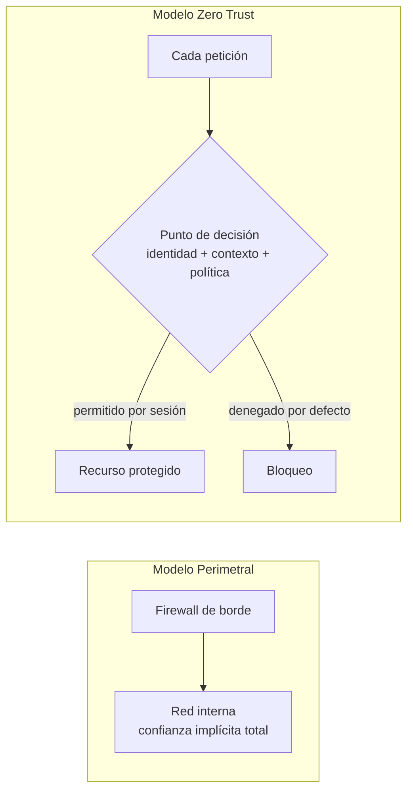
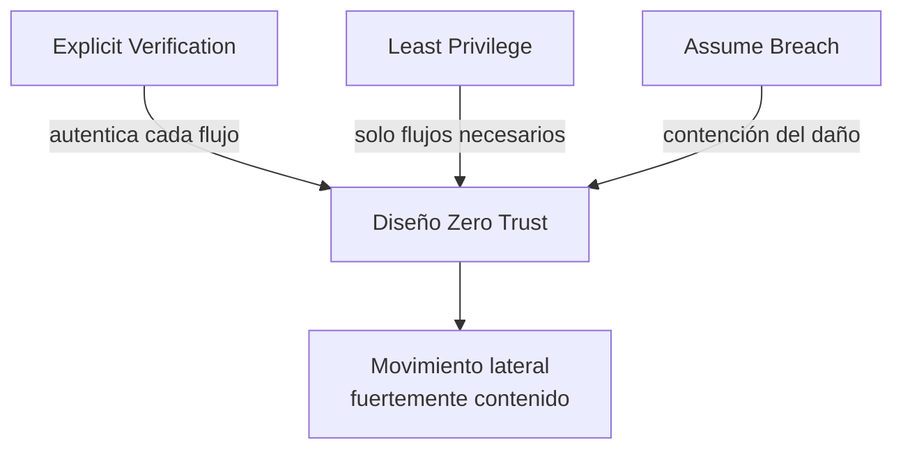
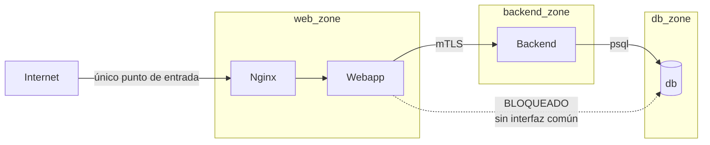
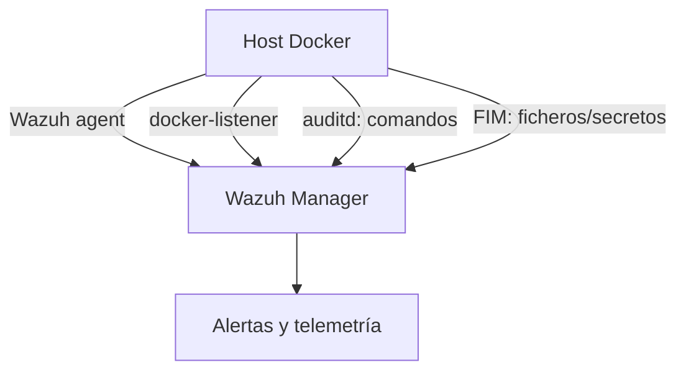
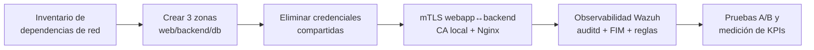

# Investigación Zero Trust

> **Documento consolidado de estudio y referencia.**
> Síntesis de la investigación recopilada en `20260603_ZeroTrust_Dump` (NIST, MITRE ATT&CK, Docker, Nginx, Wazuh y literatura académica 2020–2025).
> Orientado a su uso como base teórica del TFG "Perimetral vs Zero Trust" y como insumo directo para el Capítulo 2 (Estado del Arte) y el Capítulo 4 (Diseño).
> Las fuentes se identifican con marcadores `[CITAR: …]` reutilizables al pasar a bibliografía.

---

## Resumen Ejecutivo

Zero Trust (ZT) es un modelo de seguridad que **elimina la confianza implícita** basada en la ubicación de red: ninguna petición se considera fiable por estar "dentro" del perímetro. Su norma de referencia es **NIST SP 800-207**, que define la arquitectura Zero Trust (ZTA) como un enfoque centrado en **proteger recursos** (no segmentos de red) mediante autenticación y autorización **continuas, por sesión y basadas en políticas dinámicas** (identidad, estado del dispositivo y contexto).

Para una infraestructura de contenedores Docker organizada en `web_zone`, `backend_zone` y `db_zone`, ZT se materializa en tres palancas concretas y mutuamente reforzantes:

1. **Microsegmentación de red** — romper la red plana en dominios de confianza pequeños para contener el movimiento lateral.
2. **Identidad de servicio y mTLS** — autenticar mutuamente cada comunicación este-oeste entre contenedores.
3. **Observabilidad y detección activa** — instrumentar el host y los contenedores (Wazuh: auditd, FIM, command monitoring) bajo la premisa "assume breach".

La conclusión transversal de toda la evidencia revisada es consistente: **la segmentación, el control de secretos y TLS/mTLS son las defensas más efectivas** contra reconocimiento, robo de claves, exfiltración y movimiento lateral en contenedores. La literatura académica directa que compare perímetro vs ZT con métricas operativas (MTTD/MTTR) es escasa, lo que **refuerza el valor diferencial de un TFG con medición empírica propia**.

---

## ¿Qué es Zero Trust?

Zero Trust es un paradigma de seguridad que parte de una premisa inversa al modelo perimetral clásico: **la red interna no es un lugar de confianza**. En lugar de proteger un borde y confiar en todo lo que hay dentro, ZT exige verificar explícitamente cada acceso a cada recurso, independientemente de dónde se origine.

NIST SP 800-207 formaliza este principio en una idea central: **la ZTA protege recursos, no segmentos de red**. La decisión de conceder o denegar acceso se toma de forma dinámica en un punto de decisión de políticas, evaluando identidad, contexto y estado, y se concede **por sesión** con el mínimo privilegio necesario.



| Dimensión | Perímetro tradicional | Zero Trust |
|---|---|---|
| Unidad protegida | La red (el borde) | El recurso individual |
| Confianza interna | Implícita y amplia | Nula por defecto |
| Decisión de acceso | Basada en conectividad de red | Basada en identidad, contexto y mínimo privilegio |
| Alcance de una brecha | Amplio (movimiento lateral fácil) | Contenido (radio de daño reducido) |
| Verificación | Una vez, en el borde | Continua, por solicitud |

`[CITAR: NIST SP 800-207 — Rose et al., 2020, DOI 10.6028/NIST.SP.800-207]`

---

## Principios Fundamentales

La investigación destila tres principios operativos que se aplican directamente al diseño de contenedores:

### 1. Explicit Verification (Verificación explícita)
Cada petición entre componentes debe autenticarse y autorizarse **antes** de permitir el flujo. En Docker se traduce en políticas de red por servicio, identidad de servicio y control del tráfico este-oeste (east-west) entre zonas.

### 2. Least Privilege Access (Mínimo privilegio)
Cada zona solo debe alcanzar los puertos y endpoints estrictamente necesarios de la zona contigua: `web_zone` solo lo imprescindible de `backend_zone`, y `backend_zone` solo los puertos concretos de `db_zone`. NIST prescribe acceso **por sesión** y con los privilegios mínimos necesarios.

### 3. Assume Breach (Asumir compromiso)
Se diseña como si `web_zone` **ya estuviera comprometida**, de modo que la segmentación reduzca el radio de daño y bloquee saltos hacia `backend_zone` y `db_zone`. NIST afirma explícitamente que la ZTA está pensada para prevenir brechas y limitar el movimiento lateral interno.



`[CITAR: NIST SP 800-207 §2 — principios ZTA]`

---

## Componentes de una Arquitectura Zero Trust

Trasladados al stack Docker del proyecto, los componentes lógicos de una ZTA se mapean así:

| Componente conceptual (NIST) | Realización en Docker | Función de seguridad |
|---|---|---|
| Punto de decisión de políticas (PDP) | Reglas de red por zona + configuración mTLS de Nginx | Decide qué flujos se permiten |
| Punto de aplicación de políticas (PEP) | Nginx con `ssl_verify_client`, redes Docker aisladas | Hace cumplir la decisión |
| Identidad de recurso/servicio | Certificados de cliente/servidor firmados por CA local | Verifica quién habla con quién |
| Telemetría / monitorización continua | Wazuh agent (auditd, FIM, command monitoring) | Alimenta la detección "assume breach" |
| Zonas funcionales | `web_zone`, `backend_zone`, `db_zone` | Minimizan la zona implícitamente confiable |

La idea de diseño es que cada zona se asocia a **políticas de acceso explícitas + microsegmentación + monitoreo continuo**, formando una implementación ZTA "por zonas funcionales".

`[CITAR: NIST SP 800-207A — Chandramouli y Butcher, 2023, DOI 10.6028/NIST.SP.800-207A]`

---

## Identidad y Control de Acceso

En Zero Trust, **la conectividad de red no es identidad**. Que dos contenedores compartan red no debe bastar para que se comuniquen: cada extremo debe probar quién es. La identidad de servicio se implementa con certificados:

- Un contenedor actúa como **servidor TLS**, otro como **cliente**, y ambos confían en una **CA local** creada con OpenSSL.
- Nginx fuerza la **autenticación mutua (mTLS)** mediante `ssl_verify_client on`.

NIST advierte un matiz importante: un **certificado autofirmado no demuestra autenticidad por sí mismo**; la confianza depende del procedimiento seguro de distribución y validación de su huella por un canal independiente.

### Diferencia clave: autenticación ≠ autorización
La investigación señala que `ssl_verify_depth` (y la verificación de certificado en general) **solo valida la cadena de confianza, no decide si un sujeto concreto debe ser aceptado**. La autorización fina (qué puede hacer cada identidad) es una capa adicional sobre la autenticación.

`[CITAR: NIST Glossary — self-signed certificate]`
`[CITAR: RFC 9440 — cabeceras HTTP de identidad de cliente desde reverse proxy]`

---

## Segmentación y Microsegmentación

### Concepto
La **microsegmentación** rompe la red plana en dominios de confianza pequeños con políticas granulares, de modo que una intrusión en un contenedor **no abre automáticamente** acceso a los demás. NIST la recoge como una **variante de despliegue de ZTA**, cuya motivación es acercar los puntos de decisión a los recursos para minimizar la zona implícitamente confiable.

### Cuándo es necesaria
La microsegmentación es necesaria cuando conviven activos de **distinta criticidad** que no deben ser mutuamente alcanzables por defecto. La regla práctica: si comprometer A no debe implicar acceso a B, **A y B deben estar en segmentos distintos**.

### Aplicación a Docker
Docker permite redes definidas por el usuario y la conexión selectiva de contenedores a una o varias redes. Esto facilita el aislamiento por dominio funcional:



`web_zone` no debería compartir red con `db_zone` salvo a través de `backend_zone`, y solo mediante reglas explícitas. El acceso directo `webapp → db` queda **bloqueado a nivel L3** porque no comparten bridge.

### Red plana frente a segmentada

| Aspecto | Red Docker plana | Red segmentada |
|---|---|---|
| Visibilidad entre contenedores | Alta, alcance amplio | Reducida, solo flujos autorizados |
| Movimiento lateral | Fácil tras una intrusión | Fuertemente contenido |
| Superficie de ataque | Mayor | Menor |
| Gestión de acceso | Por conectividad de red | Por identidad, contexto y mínimo privilegio |
| Adecuación a ZTA | Baja | Alta |

`[CITAR: NIST SP 800-207 §3 — variante de microsegmentación]`
`[CITAR: CSA — What is Microsegmentation]`
`[CITAR: Docker Networking — docs.docker.com/engine/network]`

---

## Protección de Redes

La protección de red en ZT se basa en **denegación por defecto** y permiso por excepción de flujos explícitos (`web_zone → backend_zone → db_zone`). MITRE ATT&CK respalda esta estrategia: la **segmentación de red** es la mitigación recurrente frente a las técnicas más relevantes en contenedores.

| Técnica MITRE | Descripción en Docker | Mitigaciones oficiales |
|---|---|---|
| **T1046** Network Service Scanning | Un contenedor comprometido enumera servicios/puertos accesibles para preparar el salto lateral | Segmentación de red, redes Docker por usuario, restricción de flujos |
| **TA0008** Lateral Movement | Pivotar de `web` → `backend` → `db` usando red compartida o credenciales reutilizadas | Network segmentation, redes por capa funcional, mTLS + políticas, gestión de secretos |

La documentación de Docker confirma el principio habilitador: **los contenedores se comunican solo cuando comparten red o se conectan explícitamente**, lo que favorece una topología cerrada por zonas.

`[CITAR: MITRE ATT&CK — T1046 Network Service Discovery]`
`[CITAR: MITRE ATT&CK — TA0008 Lateral Movement]`

---

## Protección de Aplicaciones y Datos

La protección de datos en tránsito y de secretos es la segunda gran palanca, ligada a dos técnicas ATT&CK:

### T1552.004 — Private Keys (robo de claves)
Ocurre si claves TLS, tokens o ficheros de servicio se montan en rutas previsibles, se copian dentro de la imagen o quedan legibles para más de un contenedor.

**Mitigaciones:** gestión de secretos (no incrustar claves en imágenes ni repositorios), Docker Secrets, permisos mínimos y montajes de solo lectura, separación de CA/servidor/cliente.

### T1041 — Exfiltration Over C2 Channel
Un contenedor comprometido empaqueta datos sensibles y los envía por el tráfico normal, escondiendo la salida en peticiones aparentemente legítimas.

**Mitigaciones:** TLS/mTLS (dificulta inspección y suplantación), filtrado de tráfico y políticas de egress, segmentación y DLP para alertar sobre patrones de fuga.

> **Matiz crítico:** mTLS por sí solo **no evita la exfiltración** si el canal es legítimo. Debe combinarse con restricciones de salida y monitorización de flujo. Es un error frecuente asumir que cifrar el canal equivale a prevenir la fuga.

### mTLS entre contenedores: flujo de implementación
1. Crear CA local con OpenSSL.
2. Generar clave + CSR del contenedor-servidor y firmarlo con la CA.
3. Generar clave + CSR del contenedor-cliente y firmarlo con la misma CA.
4. Usar `clientAuth` y `serverAuth` en `extendedKeyUsage`.
5. Montar `ca.pem`, `server-cert.pem`/`server-key.pem` y `cert.pem`/`key.pem` en los contenedores (volúmenes de solo lectura, nunca en la imagen).

Configuración de referencia de Nginx como terminador mTLS:

```nginx
server {
    listen 443 ssl;
    server_name backend.local;

    ssl_certificate     /etc/nginx/certs/server.crt;
    ssl_certificate_key /etc/nginx/certs/server.key;

    ssl_client_certificate /etc/nginx/certs/ca.crt;
    ssl_verify_client on;
    ssl_verify_depth 1;

    location / {
        proxy_pass http://backend:8080;
        proxy_set_header Host $host;
        proxy_set_header X-SSL-Client-Verify $ssl_client_verify;
        proxy_set_header X-SSL-Client-DN $ssl_client_s_dn;
    }
}
```

| Directiva Nginx | Función |
|---|---|
| `ssl_verify_client on` | Obliga a que el cliente presente un certificado válido |
| `ssl_client_certificate` | CA(s) usadas para validar el certificado de cliente |
| `ssl_verify_depth` | Limita la profundidad de la cadena de confianza aceptada |

`[CITAR: Docker Docs — Protect the Docker daemon socket]`
`[CITAR: Nginx — ngx_http_ssl_module]`
`[CITAR: MITRE ATT&CK — T1552.004 Private Keys; T1041 Exfiltration Over C2]`

---

## Monitoreo, Telemetría y Detección

Bajo "assume breach", la detección activa es imprescindible. La investigación sobre **Wazuh** distingue con claridad lo **soportado oficialmente** de lo **experimental**.

### Arquitectura de despliegue recomendada
La detección más robusta para contenedores **no** se logra metiendo el agente solo dentro del contenedor (ve únicamente su propio namespace), sino instrumentando el host:



1. Instalar **Wazuh agent en el host Docker**.
2. Activar `docker-listener` para visibilidad de runtime.
3. Habilitar **auditd** para comandos como `nmap`, `curl`, shells y acceso a secretos.
4. Activar **FIM** sobre rutas de configuración, secretos montados y directorios críticos.
5. Crear **reglas locales + listas CDB** para binarios y patrones sospechosos.

### Capacidades y su mapeo a amenazas

| Objetivo de detección | Capacidad Wazuh | Naturaleza |
|---|---|---|
| Lectura de variables de entorno con credenciales | auditd + reglas + FIM (no hay detección directa de env vars) | Inferida |
| Enumeración interna de red (`nmap`, `nc`) | Command monitoring + listas CDB | Soportada |
| `curl` contra servicios internos | auditd / command monitoring | Soportada |
| Cambios en ficheros/secretos montados | FIM (checksums y atributos) | Soportada |

### Reglas de ejemplo (experimentales, adaptar al decoder real)

```xml
<rule id="100100" level="12">
  <if_sid>80700</if_sid>
  <match>nmap</match>
  <description>Posible reconocimiento interno con nmap</description>
</rule>

<rule id="100102" level="14">
  <if_sid>80700</if_sid>
  <match>env</match>
  <description>Posible lectura de variables de entorno sensibles</description>
</rule>
```

> **Limitación documentada:** la detección de env vars **no es directa**; se infiere por acceso a procesos, archivos o comandos. **Sysmon for Linux** no aparece como integración principal para contenedores; lo estable es auditd + system calls + docker-listener.

`[CITAR: Wazuh Docs — Monitoring Docker, Audit configuration, FIM, Custom decoders]`

---

## Casos de Uso y Patrones de Implementación

Aplicación de todo lo anterior a los dos escenarios del proyecto:

| Vector / Técnica | Escenario A (red plana) | Escenario B (zonas + mTLS + Wazuh) |
|---|---|---|
| Escaneo de red (T1046) | `web` descubre `backend` y `db` libremente | Segmentación reduce visibilidad; Wazuh alerta sobre patrones de scan |
| Robo de claves (T1552.004) | Clave filtrada permite suplantar servicio y acceder a backend/db | Secretos separados por zona; caer `web` no expone claves de `backend`/`db` |
| Exfiltración (T1041) | HTTP abierto, distinción benigno/malicioso débil | mTLS + telemetría Wazuh + restricción de egress |
| Movimiento lateral (TA0008) | Pivoting y reutilización de credenciales hacia `db` | Intrusión en `web` no abre acceso directo a `db` |

### Métricas cuantitativas recomendadas
Indicadores a extraer para comparar A vs B:

- **Reducción de superficie de ataque**: nº de puertos/rutas east-west eliminados tras segmentar.
- **Tiempo de detección (MTTD)**: latencia hasta que una política bloquea o alerta sobre tráfico no autorizado.
- **Tasa de bloqueo**: % de intentos de comunicación entre zonas no permitidas que se deniegan.
- **Profundidad de compromiso**: nº de saltos desde `web_zone` antes de la contención (red plana = mayor; segmentada = idealmente 0–1 salto útil).

---

## Estrategias de Migración

Ruta sintetizada de red plana → arquitectura por zonas funcionales:



1. **Inventariar flujos reales** (qué servicio necesita hablar con cuál y por qué puerto).
2. **Segmentar** en `web_zone`, `backend_zone`, `db_zone` con denegación por defecto.
3. **Separar secretos** por servicio (no credenciales compartidas).
4. **Introducir mTLS** en el canal crítico, empezando por un solo canal (single channel) para acotar el riesgo.
5. **Instrumentar detección** en el host y validar que las reglas disparan.
6. **Medir** comparativamente contra el escenario perimetral.

---

## Herramientas y Tecnologías Relevantes

| Tecnología | Rol en la arquitectura ZT | Fuente de referencia |
|---|---|---|
| Docker user-defined networks | Microsegmentación por zonas, aislamiento L3 | `[CITAR: Docker Networking]` |
| OpenSSL | Creación de CA local y emisión de certificados | `[CITAR: Docker Docs — Certificates]` |
| Nginx (`ngx_http_ssl_module`) | Terminador mTLS, aplicación de políticas (PEP) | `[CITAR: Nginx ssl_module]` |
| Docker Secrets | Distribución de secretos sin incrustarlos en imágenes | `[CITAR: Docker Swarm PKI]` |
| Wazuh (auditd, FIM, docker-listener) | Telemetría y detección host-based | `[CITAR: Wazuh Docs]` |
| RFC 9440 | Transmitir identidad de cliente desde reverse proxy al backend | `[CITAR: RFC 9440]` |

---

## Buenas Prácticas

- **Denegación por defecto**: permitir solo flujos explícitos entre zonas.
- **Mínimo privilegio en secretos**: separar CA, servidor y cliente; montar como solo lectura; nunca en la imagen base.
- **Proteger claves privadas** con permisos restrictivos; asumir que quien posee la clave puede causar daño con privilegios altos.
- **Single channel primero**: introducir mTLS en un canal acotado antes de extenderlo a todo el stack.
- **Monitorizar handshakes y verificación**: registrar `X-SSL-Client-Verify`, `X-SSL-Client-DN` y handshakes fallidos para detectar suplantación.
- **Instrumentar desde el host**, no solo dentro del contenedor, para mayor visibilidad.

---

## Errores Comunes

- **Confundir cifrado con prevención de fuga**: mTLS no evita la exfiltración si el canal es legítimo; hace falta control de egress y DLP.
- **Confundir autenticación con autorización**: `ssl_verify_depth` limita la cadena, no decide si un sujeto debe ser aceptado.
- **Confiar en certificados autofirmados sin distribución controlada**: la confianza depende del procedimiento de distribución/validación de la huella.
- **Incrustar claves en imágenes** o montarlas en rutas previsibles legibles por varios contenedores (T1552.004).
- **Asumir que el agente dentro del contenedor lo ve todo**: solo ve su propio namespace; muchas detecciones requieren el host.
- **Tratar Sysmon for Linux como mecanismo central de contenedores**: no es la integración principal documentada; usar auditd + syscalls + docker-listener.
- **Suponer que la red interna es de confianza**: es exactamente la premisa que ZT invalida.

---

## Comparación de Enfoques y Frameworks

### Frameworks normativos y su aporte

| Fuente | Tipo | Aporte principal |
|---|---|---|
| **NIST SP 800-207** (Rose et al., 2020) | Estándar | Principios ZTA, componentes lógicos, variante de microsegmentación. Referencia base del diseño por zonas. |
| **NIST SP 800-207A** (Chandramouli y Butcher, 2023) | Guía técnica | ZTA cloud-native: políticas de capa de red/identidad, gateways, service mesh. Muy relevante para contenedores. |
| **MITRE ATT&CK** | Marco de amenazas | Técnicas (T1046, T1552.004, T1041, TA0008) y mitigaciones oficiales. |
| **CSA — Microsegmentation** | Divulgación técnica | Resume contención de propagación lateral y protección east-west. |

### Literatura comparativa (2020–2025)

| Estudio | Tipo | KPIs | Hallazgo clave | Limitación |
|---|---|---|---|---|
| Shandilya et al. (2022), *Sustainability*, DOI 10.3390/su141811213 | Revisión comparativa | No MTTD/MTTR | ZT mejora verificación continua, visibilidad y contención vs perímetro | No experimental |
| Gambo y Almulhem (2025), arXiv | Revisión sistemática | No cuantitativos | ZTA limita movimiento lateral; protege recursos, no la red entera | No experimental |
| Crit. Analysis of ZT in Cloud (2025), arXiv | Revisión crítica | No operativos | ZT asume desconfianza por defecto + verificación continua | No compara contra perímetro |
| ZT en IAM cloud (UPT, 2025) | Revisión académica | No cuantitativos | Útil para identidad y límites de confianza implícita | Menor indexación |

> **Vacío detectado:** la literatura **comparativa directa** perímetro vs ZT con métricas operativas (MTTD/MTTR, tasa de bloqueo, profundidad de ataque) en Docker/Kubernetes es **escasa**. Predominan revisiones y propuestas de arquitectura. Esto justifica el enfoque experimental propio del TFG.

`[CITAR: Shandilya et al. 2022; Gambo y Almulhem 2025; arXiv 2411.06139; NIST SP 800-207/207A]`

---

## Conclusiones Clave

1. **Zero Trust protege recursos, no perímetros**: la confianza implícita interna es el problema que el modelo elimina.
2. **Tres palancas se refuerzan**: microsegmentación (red), identidad/mTLS (comunicación) y detección host-based (observabilidad).
3. **La segmentación es la defensa más consistente** frente a escaneo, movimiento lateral y exfiltración en contenedores, según MITRE y la literatura.
4. **mTLS autentica, no autoriza ni previene fuga por sí solo**: debe combinarse con control de egress y monitorización.
5. **La detección efectiva se instrumenta desde el host**, no solo dentro del contenedor.
6. **Existe un vacío de evidencia comparativa cuantitativa** que un TFG con medición empírica (A vs B) cubre con valor diferencial.

---

## Temas Pendientes para Investigación Adicional

- **Costes de rendimiento del mTLS** este-oeste en contenedores: latencia y CPU del cifrado/verificación (referencia parcial: *Performance Analysis of Zero-Trust multi-cloud*, arXiv 2105.02334, no es Docker puro).
- **Métricas operativas reales** (MTTD/MTTR) en Docker: hay que generarlas experimentalmente; la literatura no las aporta directamente.
- **Revocación y rotación de certificados** sin PKI: cómo gestionar el ciclo de vida en laboratorio (limitación reconocida de los autofirmados).
- **Detección fiable de lectura de env vars**: no existe mecanismo directo; queda por validar la eficacia de la inferencia vía auditd/FIM.
- **Autorización fina por identidad** (más allá de autenticar el certificado): política de qué puede hacer cada servicio.
- **Papers experimentales adicionales (6–8)** con foco IEEE/ACM/Springer/Elsevier, separando experimentales de revisiones, para cerrar §2.7 del Estado del Arte.
- **Contradicción a resolver**: la documentación describe el agente en contenedor como opción válida "ligera" pero a la vez desaconseja confiar solo en él para runtime completo; conviene fijar la postura del TFG y justificarla.

---

## Glosario de Términos

| Término | Definición |
|---|---|
| **Zero Trust (ZT)** | Modelo de seguridad que elimina la confianza implícita y verifica explícitamente cada acceso. |
| **ZTA** | Zero Trust Architecture: realización arquitectónica de los principios ZT (NIST SP 800-207). |
| **Confianza implícita** | Suposición de que lo que está dentro de la red es fiable; premisa que ZT invalida. |
| **Microsegmentación** | División de la red en dominios pequeños con políticas granulares para contener el movimiento lateral. |
| **Movimiento lateral (TA0008)** | Técnicas para pivotar entre sistemas tras un compromiso inicial. |
| **Tráfico east-west** | Comunicación entre servicios internos (contenedor↔contenedor), frente al norte-sur (cliente↔servidor). |
| **mTLS** | TLS mutuo: ambos extremos presentan y validan certificados; autenticación bidireccional. |
| **CA** | Autoridad de certificación; aquí, una CA local creada con OpenSSL para firmar certs de servicio. |
| **Certificado autofirmado** | Certificado no respaldado por una CA externa; su confianza depende de la distribución segura. |
| **PEP / PDP** | Policy Enforcement/Decision Point: aplica / decide las políticas de acceso. |
| **FIM** | File Integrity Monitoring: detección de cambios en ficheros mediante checksums y atributos. |
| **auditd** | Subsistema de auditoría de Linux; base para monitorizar comandos y accesos. |
| **docker-listener** | Componente de Wazuh para monitorizar eventos de Docker desde el host. |
| **CDB list** | Lista de Wazuh (p. ej. binarios sospechosos) usada en reglas de detección. |
| **MTTD / MTTR** | Mean Time To Detect / Respond: métricas operativas de detección y respuesta. |
| **Egress** | Tráfico de salida; su control limita rutas de exfiltración. |
| **DLP** | Data Loss Prevention: detección/bloqueo de fuga de datos sensibles. |

---

> **Trazabilidad:** documento sintetizado a partir de `docs/01_investigacion/20260603_ZeroTrust_Dump` (bloques 1–5). Las URLs originales de cada afirmación están en el dump fuente; aquí se conservan como marcadores `[CITAR: …]` para su conversión a BibTeX en `docs/03_memoria_tfg/99_bibliografia.md`.
