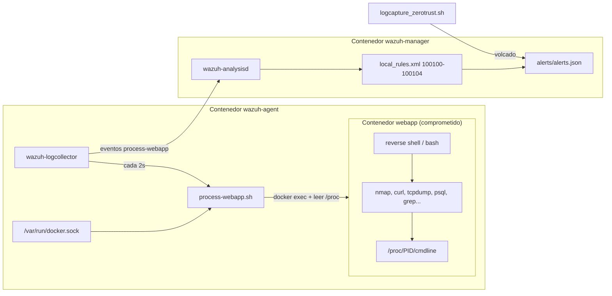

# Diario de Laboratorio — 2026-06-09
## Pruebas A/B Escenario B: sesiones post-RCE, bypass backend y rediseño de detección Wazuh

> **Operador:** Cory  
> **Contexto:** Recuperación del hito 09/06 (`ejecutar_pruebas_ab`). Sesiones en `tests/logs/zerotrust_sesion_*`.  
> **Resultado:** Controles ZT verificados en sesión `20260609_085050`; KPI G1 (latencia Wazuh) **no medible** en esa sesión por fallo de detección. Rediseño aplicado el mismo día (process-webapp + protocolo de captura unificado).  
> **Trazabilidad ADR:** `admin/DECISIONS_LOG.md` → entrada **2026-06-09**.

---

## 1. Resumen ejecutivo

| Tema | Problema | Solución |
|------|----------|----------|
| Bypass lateral `:5000` | Flask en `0.0.0.0` anulaba mTLS | `app.run(host="127.0.0.1")` en `backend/app.py` |
| Wazuh sin alertas post-RCE | Polling 15 s + procesos efímeros + agente inestable | `process-webapp` (lectura `/proc` vía `docker exec`) cada **2 s** + reglas 100100–100104 |
| Modelo de amenaza erróneo | Reglas 100110/100111 para `docker exec` | Eliminadas; el ataque es **reverse shell interno** |
| Protocolo de sesión | Wazuh opcional; redes ZT desconectan agente | `logcapture_zerotrust.sh` levanta Wazuh, reconecta agente y valida `process-webapp` |

**Sesión oficial Escenario B (KPI completo A↔B):** `tests/logs/zerotrust_sesion_20260609_130120/`  
**Sesión histórica controles ZT (sin G1):** `tests/logs/zerotrust_sesion_20260609_085050/`  
**Plantilla KPI v2 §2/§3:** rellenada en `tests/00_PLANTILLA_KPI_v2.md` (commit `271b38d9`).

---

## 2. Cronología de sesiones de prueba

| Sesión | Estado | Motivo |
|--------|--------|--------|
| `20260608_203207`, `20260608_205057` | **Invalidadas** | `curl http://backend:5000/empleados` devolvía JSON (Flask en `0.0.0.0`) |
| `20260609_080216`, `20260609_081122` | Parciales | Pre-fix o captura fragmentada |
| `20260609_085050` | **Histórica (E1–E3, G2–G3)** | Controles ZT OK; G1 sin alertas `process-webapp` en ventana post-RCE |
| `20260609_130120` | **Oficial (KPI §2/§3)** | 2.º intento post-RCE; G1 `(true, 22 s)`; evidencias limpiadas; plantilla cerrada |

---

## 3. Problema A — Bypass del PEP mTLS (Flask en `0.0.0.0`)

### Síntoma
En sesiones del 08/06, `curl http://backend:5000/empleados` desde webapp devolvía el JSON de empleados igual que en Escenario A, sin pasar por Nginx mTLS (puerto 443).

### Causa raíz
`infra/zero_trust/backend/app.py` arrancaba Flask con `host="0.0.0.0"`, exponiendo la API en la red `backend_zone`.

### Solución
```python
app.run(host="127.0.0.1", port=5000)
```
Solo Nginx (PEP) expone `:443` hacia otras zonas.

### Evidencia de corrección (sesión `085050`)
- `e1_scan.log`: backend solo `443/tcp open`; `db` no resuelve.
- `lateral.json`: vacío; `lateral_attempt.log`: `connection refused` en `:5000`.
- `lateral.pcap`: tráfico TLS/RST (8386 B, 26 paquetes).

---

## 4. Problema B — Wazuh no generó alertas en la ventana post-RCE

### Síntoma
En `zerotrust_sesion_20260609_085050/wazuh_alerts.json`:
- Única regla **100100** a las **06:05 UTC** (prueba previa, no post-RCE).
- Entre **06:52–06:55 UTC** (T0 → fin post-RCE) **ninguna** alerta 100100/100101.
- El volcado termina con reinicio del agente a las **06:51:47 UTC**, justo antes del ataque.

### Causas raíz (acumuladas)

1. **Muestreo demasiado lento:** `process-list` (`ps auxww`) cada **15 s**. `nmap` ~4 s y `curl` <1 s no coincidían con ningún ciclo de `ps`.
2. **Fuente de telemetría inadecuada para el escenario:** el post-RCE ocurre **dentro** de webapp (reverse shell), no como `docker exec` desde el host. Las reglas **100110/100111** (docker-listener + exec) no aplican al vector real.
3. **Inestabilidad del agente al levantar ZT:** `docker compose up` del stack ZT **recrea** las redes externas (`zero_trust_web_zone`, etc.). El agente Wazuh pierde conectividad y se reinicia (~06:51 UTC en sesión `085050`), dejando una ventana corta y desalineada respecto al polling.
4. **Volcado acumulativo:** `alerts.json` mezcla histórico; la ausencia de alertas en la ventana T0→T_fin confirma que no se generaron, no solo que no se copiaron.

### Qué **no** es el problema
- Los controles ZT (microsegmentación, mTLS) **sí funcionaron** — la actividad maliciosa está en `session_chrono.txt`, `e1_scan.log`, `lateral_attempt.log`.
- Las alertas **100120** (FIM certs) son ruido de inode WSL2/NTFS, no indicadores de ataque.

---

## 5. Solución — Rediseño de detección Wazuh (09/06)

### 5.1 Nueva fuente: `process-webapp`

Script `infra/zero_trust/wazuh/agent/process-webapp.sh` (evolución final tras depuración 09/06 tarde):
- Resuelve el contenedor webapp por labels Compose (`com.docker.compose.service=webapp`, `project=zero_trust`).
- Cada **2 s**, el **logcollector** del agente ejecuta el script (alias `process-webapp`).
- El script usa el **socket Docker** montado en el agente (`/var/run/docker.sock`) y hace `docker exec` + lectura de `/proc/*/cmdline` **dentro** de webapp.
- **No** usa `docker top` (falla en Docker Desktop: `Couldn't find PID field in ps output`).
- **No** usa `ps` dentro de webapp (no está instalado en la imagen Flask).

Iteraciones descartadas del mismo día:
1. `docker top` → incompatible con Docker Desktop + WSL2.
2. Script con shebang directo → fallo `exec: no such file or directory` por **CRLF** (fichero editado en Windows); mitigado con LF, `.gitattributes`, `sed` en Dockerfile e invocación `bash script.sh`.
3. Regla **100104** con regex OSRegex inválida `(DB_|...)` → `wazuh-analysisd` no arrancaba; corregida con `<match>grep</match>` + `<regex type="pcre2">`.

### 5.2 Reglas actualizadas (`local_rules.xml`)

| Regla | Fuente | Detección |
|-------|--------|-----------|
| 100100 | `process-webapp` | `nmap` (E1, T1046) |
| 100101 | `process-webapp` | `curl` + `backend` (lateral, T1041) |
| 100102 | `process-webapp` | `tcpdump` (E3 pcap, T1040) |
| 100103 | `process-webapp` | `psql` (T_objetivo, T1021) |
| 100104 | `process-webapp` | `grep` credenciales env (T1552.001) |
| 100105/100106 | `process-list` (respaldo, 5 s) | nmap / curl→backend |
| ~~100110/100111~~ | — | **Eliminadas** (docker exec; fuera del modelo de amenaza) |
| 100120 | syscheck | FIM certs (T1552.004) — sin cambio |

### 5.3 Cambios en `agent/ossec.conf`

- `process-webapp`: frecuencia **2 s** (principal).
- `process-list` (`ps auxww`): frecuencia **5 s** (respaldo).
- `docker-listener`: se mantiene solo para ciclo de vida de contenedores.

---

## 6. Cambio en el protocolo de ejecución de sesión

### Antes (hasta 08/06)

1. Levantar ZT manualmente o con script parcial.
2. Wazuh asumido “ya en marcha”; sin validación previa.
3. RCE + post-RCE; copia manual de artefactos.
4. Volcado de `wazuh_alerts.json` al final (histórico mezclado).

### Después (desde 09/06)

**Script único:** `tests/scripts/logcapture_zerotrust.sh`

| Paso | Acción |
|------|--------|
| 1 | ZT compose `up --build -d` (crea redes `zero_trust_web_zone`, `zero_trust_backend_zone`) |
| 2 | Wazuh compose `up --build -d` (**después** de ZT; las redes externas deben existir) |
| 2b | Reinicio manager + agente; comprobación `process-webapp` ve webapp |
| 3 | Usuario: RCE + post-RCE (`tests/POST-RCE comandos y notas.txt`) |
| 4 | ENTER en script → copia `/tmp/*`, logs servicio, `wazuh_alerts.json` |

> **Corrección 09/06:** Wazuh no puede levantar antes que ZT: `wazuh/docker-compose.yaml` declara `zt_web_zone` y `zt_backend_zone` como redes **external**; si ZT no está arriba, `docker compose up` de Wazuh falla.

**Condición de inicio del ataque:** no lanzar RCE hasta ver el OK de `process-webapp`.

**Latencia esperada G1:** ≤5 s respecto a T0 para reglas 100100–100104 (con agente estable).

### Comandos de referencia

```bash
# Sesión formal Escenario B (desde raíz del repo)
./tests/scripts/logcapture_zerotrust.sh

# Si solo se actualizó config Wazuh sin sesión completa
cd infra/zero_trust/wazuh
docker compose up --build -d
docker compose restart wazuh-manager wazuh-agent
```

---

## 7. Impacto en KPIs y memoria

| KPI / sección | Sesión `085050` | Acción |
|---------------|-----------------|--------|
| E1, E2, E3 (controles red/mTLS) | Datos válidos | Usar en `00_PLANTILLA_KPI_v2.md` §2 |
| G2, G3 | Datos válidos | Usar en §2 |
| G1 (Δt detección Wazuh) | **Sin timestamp de alerta** en ventana T0→T_fin | Documentar limitación; **repetir sesión** tras rediseño |
| §2.4 Observaciones | Incluir: sesiones 08/06 invalidadas; fix Flask; fallo detección G1; rediseño 09/06 | |
| Cap. 5 limitaciones | Polling vs procesos efímeros en Docker Desktop + WSL2 | |

---

## 8. Ficheros modificados (trazabilidad git)

| Fichero | Cambio |
|---------|--------|
| `infra/zero_trust/backend/app.py` | Flask `127.0.0.1:5000` |
| `infra/zero_trust/wazuh/agent/process-webapp.sh` | Lectura `/proc` vía `docker exec`; LF + `.gitattributes` |
| `infra/zero_trust/wazuh/agent/.gitattributes` | `*.sh text eol=lf` (evitar CRLF en WSL) |
| `infra/zero_trust/wazuh/agent/ossec.conf` | process-webapp 2s; process-list 5s |
| `infra/zero_trust/wazuh/agent/Dockerfile` | `docker.io` + script |
| `infra/zero_trust/wazuh/manager/local_rules.xml` | Reglas post-RCE; sin docker exec |
| `infra/zero_trust/wazuh/manager/wazuh_etc/rules/local_rules.xml` | Idem |
| `tests/scripts/logcapture_zerotrust.sh` | Wazuh integrado + reconexión agente |
| `tests/POST-RCE comandos y notas.txt` | Alertas Wazuh esperadas |
| `tests/scripts/logcapture_perimetral.sh` | Restaurado Escenario A |
| `admin/DECISIONS_LOG.md` | ADR 2026-06-09 |

---

## 9. Próximo paso

Ejecutar **una sesión corta** con el protocolo nuevo para obtener alertas `100100`–`100104` con `location: process-webapp` y cerrar **G1** en la plantilla KPI. La sesión `085050` permanece como evidencia de controles ZT.

---

## 10. Mecanismo de detección post-RCE (texto para Cap. 4 — Diseño / Cap. 5 — Implantación)

### 10.1 Modelo de amenaza que gobierna el diseño

Tras el RCE (SSTI → reverse shell), el atacante opera **como proceso hijo dentro del contenedor `webapp`**. No se modela `docker exec` desde el operador del laboratorio: eso sería actividad de administración, no post-explotación.

Por tanto, la telemetría debe responder a: *«¿qué comandos se ejecutan dentro de webapp tras la compromisión?»*, no *«¿alguien ha hecho exec al contenedor desde fuera?»*.

Los controles de red (microsegmentación, mTLS) y los de detección (Wazuh) son **complementarios** en el marco Assume Breach: la red limita impacto; Wazuh mide **MTTD** (KPI G1).

### 10.2 Arquitectura del subsistema Wazuh en Escenario B



**Componentes:**

| Componente | Rol |
|------------|-----|
| `wazuh-manager` | Motor de reglas; persiste alertas en `alerts.json` |
| `wazuh-agent` | Recolección: FIM certs, docker-listener (ciclo de vida), **process-webapp**, process-list (respaldo) |
| `process-webapp.sh` | Puente Docker API → namespace de procesos de webapp |
| `local_rules.xml` | Correlación MITRE (T1046, T1041, T1040, T1021, T1552.001) |
| Redes externas | Agente unido a `zero_trust_web_zone` y `zero_trust_backend_zone` **tras** levantar ZT |

**No desplegado en el laboratorio:** Wazuh Indexer/Dashboard (`wazuh.indexer` → error Filebeat esperado; no afecta a `alerts.json`).

### 10.3 Flujo de datos paso a paso

1. **Arranque (orden obligatorio):** `zero_trust` compose crea redes → `wazuh` compose adjunta el agente a esas redes y monta socket Docker + certs FIM.
2. **Muestreo (cada 2 s):** `wazuh-logcollector` ejecuta `bash /var/ossec/scripts/process-webapp.sh`.
3. **Resolución de objetivo:** el script localiza `zero_trust-webapp-1` vía labels Compose.
4. **Extracción de procesos:** `docker exec webapp sh -c '...'` recorre `/proc/[0-9]*/cmdline` y emite una línea por proceso (línea de comando con espacios en lugar de `\0`).
5. **Envío al manager:** cada snapshot se envía como log con `location=process-webapp` (decoder 530 — salida de comando).
6. **Correlación:** `analysisd` aplica reglas del grupo `zerotrust,` si la línea contiene patrones (`nmap`, `curl`+`backend`, etc.).
7. **Evidencia KPI:** al final de la sesión, `logcapture_zerotrust.sh` copia `alerts.json`; G1 = `timestamp(alerta 100100)` − `T0_efectivo`.

### 10.4 Por qué no bastan otras fuentes del agente

| Fuente | Límite en este entorno |
|--------|-------------------------|
| `process-list` (`ps auxww`, pid:host) | Procesos efímeros y visibilidad irregular de PIDs de contenedor en Docker Desktop; polling más lento (5 s) |
| `docker-listener` | Eventos de API Docker (start/stop/exec **externo**), no comandos dentro de un shell ya abierto |
| `auditd` en host WSL2 | No disponible de forma fiable en Docker Desktop + WSL2 (ADR 2026-06-04) |
| Agente **dentro** de webapp | Solo vería su propio namespace; no es el patrón elegido (un agente lateral observa el contenedor víctima vía Docker socket) |

La solución híbrida **agente lateral + socket Docker + lectura /proc en el víctima** aproxima, en laboratorio, lo que en producción haría un agente en el nodo Kubernetes con visibilidad completa del cgroup.

### 10.5 Reglas custom y mapeo al protocolo post-RCE

| Paso POST-RCE | Comando típico | Regla | MITRE |
|---------------|----------------|-------|-------|
| T_exfil_creds | `env \| grep -E 'DB_\|POSTGRES\|SECRET'` | 100104 | T1552.001 |
| E1 | `nmap -sT ... backend db nginx` | 100100 | T1046 |
| T_lateral | `curl http://backend:5000/...` | 100101 | T1041 |
| T_e3_pcap | `tcpdump -i any ... host backend` | 100102 | T1040 |
| T_objetivo | `psql -h db ...` | 100103 | T1021 |
| FIM (no post-RCE rutinario) | cambio en `certs/` | 100120 | T1552.004 |

Reglas 100105/100106 duplican 100100/100101 sobre `process-list` como red de seguridad.

### 10.6 Limitaciones explícitas (honestidad metodológica)

- **Muestreo periódico, no tiempo real:** ventana máxima de detección ≈ intervalo de polling (2 s) + duración del comando; comandos más cortos que el intervalo pueden escapar (mitigado reduciendo frecuencia de 15 s → 2 s).
- **Dependencia del socket Docker:** si el socket no está montado o el daemon no resuelve el contenedor, el script devuelve `no-webapp-container` o `docker-exec-failed`.
- **Entorno de desarrollo Windows/WSL2:** CRLF en scripts, `docker top` roto, FIM con falsos positivos de inode en volúmenes NTFS — documentados y mitigados en implementación, no ignorados.
- **Indexer ausente:** sin dashboard; evaluación cuantitativa basada en `alerts.json` y cronología manual (`session_chrono.txt`, `t0_efectivo.txt`).

### 10.7 Comprobaciones operativas antes del RCE

```bash
# 1. ZT arriba (redes externas)
cd infra/zero_trust && docker compose ps

# 2. Wazuh manager healthy + agente conectado
cd infra/zero_trust/wazuh && docker compose ps

# 3. process-webapp lista procesos (debe mostrar al menos python app.py)
docker exec wazuh-wazuh-agent-1 bash /var/ossec/scripts/process-webapp.sh

# 4. logcollector monitoriza la fuente
docker exec wazuh-wazuh-agent-1 grep process-webapp /var/ossec/logs/ossec.log | tail -2
```

---

## 11. Incidencias de implantación (09/06 tarde) — depuración

| # | Síntoma | Causa | Fix |
|---|---------|-------|-----|
| 1 | `Syntax error on tag 'regex' in rule 100104` | Paréntesis en OSRegex | `<match>grep</match>` + `regex type="pcre2"` |
| 2 | `exec process-webapp.sh: no such file or directory` | CRLF (`#!/bin/bash\r`) | LF, `.gitattributes`, `sed` en Dockerfile, `bash script` |
| 3 | Salida `docker-top-failed` | `docker top` incompatible Docker Desktop | Lectura `/proc/*/cmdline` vía `docker exec` |
| 4 | `Failed to connect to wazuh.indexer` | Indexer no desplegado | Ignorar; `alerts.json` es la fuente KPI |
| 5 | Wazuh compose falla si va primero | Redes `external` inexistentes | Orden ZT → Wazuh en `logcapture_zerotrust.sh` |

---

## 12. Sesión de cierre KPI — `zerotrust_sesion_20260609_130120` (09/06 tarde)

> **Operador:** Cory  
> **Objetivo:** Validar G1 tras rediseño Wazuh; cerrar plantilla `tests/00_PLANTILLA_KPI_v2.md` §2/§3 y cuadro comparativo A↔B.  
> **Commit:** `271b38d9` — Arranque sesión: `2026-06-09T13:01:21+02:00` (`session_meta.txt`).  
> **T0 oficial (2.º intento):** `13:14:08 CEST` = `11:14:08 UTC` (`t0_efectivo.txt`).

### 12.1 Resumen ejecutivo

| Resultado | Estado |
|-----------|--------|
| Controles ZT (E1–E3, G2, G3) | ✅ Validados — idénticos a `085050` |
| G1 Wazuh `(true, 22 s)` | ✅ Primera alerta **100100** (nmap) a `11:14:30 UTC` |
| Plantilla KPI v2 §2/§3 | ✅ Rellenada y auditada contra sesión limpia |
| Carpeta de evidencias | ✅ 18 ficheros; post-limpieza solo 2.º intento |

### 12.2 Cronología del 2.º intento (único válido para KPI)

| Hito (CEST) | UTC | Δ vs T0 | Evidencia |
|-------------|-----|---------|-----------|
| T0_efectivo | 13:14:08 | 11:14:08 | 0 | `t0_efectivo.txt` |
| T_exfil_creds | 13:14:16 | 11:14:16 | 8 s | `creds.txt` (vacío) |
| E1 nmap | 13:14:25 | 11:14:25 | — | `e1_scan.log` |
| T_e3_pcap | 13:14:50 | 11:14:50 | 42 s | `lateral.pcap`, `tcpdump.log` |
| T_lateral | 13:15:15 / 13:15:28 | 11:15:15 / 11:15:32 | 67 s | `lateral_attempt.log`, `backend.log` L17 |
| T_objetivo | 13:16:18 | 11:16:18 | 130 s | `dump.txt` |

**Alertas Wazuh (UTC → CEST):** 100100 `11:14:30`, 100102 `11:14:50`, 100103 `11:16:47`. Sin 100101 ni 100104 en el 2.º intento (procesos efímeros vs poll 2 s).

### 12.3 KPIs medidos (sesión limpia → plantilla §2.1)

| Cód. | Valor | Evidencia principal |
|------|-------|---------------------|
| G1 | `(true, 22 s)` | `wazuh_alerts.json` L1 |
| G2 | 1 nodo | `e1_scan.log`, `dump.txt` |
| G3 | `(true, 100 %)` | `creds.txt`, `lateral.json`, `dump.txt` |
| E1 | 1 / 3 | `e1_scan.log` (mismos 3 objetivos que A: `:5000`, `db:5432`, `nginx:80`) |
| E2 | 0 reg. / 0 B | `creds.txt`, `lateral.json` |
| E3 | cifrado + rechazado | `lateral.pcap` (26 pkts, 8386 B), `backend.log` L17 |

**Cuadro §3:** reducción **67 %** en G2/E1; E2 de ~766 B → 0 B; G1 de `(false, ∞)` → `(true, 22 s)`.

### 12.4 Problemas encontrados y soluciones (esta sesión de trabajo)

| # | Problema | Causa raíz | Solución aplicada |
|---|----------|------------|-------------------|
| 1 | **1.er intento post-RCE abortado** | Pegado multilínea en reverse shell rompió `nohup tcpdump` (`Exit 1`); sin `lateral.pcap` | Reinicio de RS (~13:14); **solo 2.º intento** cuenta para KPI |
| 2 | **tcpdump huérfano** | `nohup tcpdump` lanzado mal antes del `exit` siguió vivo y generó alertas 100102 pre-13:14:50 | Documentado; eliminado en limpieza de `wazuh_alerts.json` (100102 &lt; `11:14:50 UTC`) |
| 3 | **Captura parcial al pulsar ENTER** | `logcapture_zerotrust.sh` línea 128: `syntax error near '('` — **CRLF** (`then\r`) en script editado en Windows | Pasos [3/7] OK; [4–7] no ejecutados. Fix: LF en script + `tests/scripts/.gitattributes` (`*.sh eol=lf`); echo sin paréntesis en L128–130 |
| 4 | **Faltaban logs de servicio** | Fallo §3 anterior | Volcado manual `nginx.log`, `webapp.log`, `backend.log`, `db.log`, `compose_all.log` |
| 5 | **Error al volcar `wazuh_alerts.json`** | (a) CWD `wazuh/` no raíz repo; (b) typo `grep2026` sin espacio; (c) contenedor agente en lugar de manager | Comando correcto desde raíz: `docker exec wazuh-wazuh-manager-1 ... > tests/logs/.../wazuh_alerts.json` |
| 6 | **Confusión UTC vs CEST** | Timestamps Wazuh en UTC; shell en CEST (+2 h) | Criterio documentado: T0 y `session_chrono` en CEST; alertas correladas restando 2 h |
| 7 | **Referencias de línea obsoletas en plantilla** | Limpieza de logs cambió numeración (`wazuh` L72→L1, `backend` L172→L17) | Auditada plantilla; corregidas referencias en `00_PLANTILLA_KPI_v2.md` §2.1 y §2.4 |
| 8 | **`nc` ausente en webapp** | Imagen sin `netcat-openbsd` | Sustituido por `nmap -p 5432 db` en `T_objetivo`; anotado en §2.4 |

### 12.5 Limpieza de evidencias (solo 2.º intento)

Corte: **≥ `11:14:08 UTC`** (`T0_efectivo`). Archivos modificados:

| Archivo | Antes → Después | Acción |
|---------|-----------------|--------|
| `session_chrono.txt` | 13 → 7 líneas | Eliminadas marcas 13:09–13:11 |
| `wazuh_alerts.json` | 258 → 178 líneas | ≥ T0 UTC; sin 100102 huérfano &lt; 11:14:50 |
| `nginx.log` | 13 → 11 líneas | Eliminado SSTI 1.er RCE (`11:10:09`) |
| `backend.log` | 623 → 468 líneas | Sin `empleados` 11:11:19; sin health pre-T0 |
| `compose_all.log` | 706 → 549 líneas | Mismas reglas |

**Sin tocar (ya 2.º intento o metadatos):** `t0_efectivo.txt`, `e1_scan.log`, `lateral.*`, `dump.txt`, `tcpdump.log`, `creds.txt`, `webapp.log`, `db.log`, `compose_up.log`, `wazuh_up.log`, `session_meta.txt`.

**Verificación post-limpieza:** `e1_scan` 13:14, `backend` L17 `11:15:32`, alertas 100100/100102/100103, `lateral.pcap` 8386 B.

### 12.6 Archivos de código/docs tocados en esta sesión

| Archivo | Cambio |
|---------|--------|
| `tests/00_PLANTILLA_KPI_v2.md` | §2 y §3 rellenados; referencias L1/L17; §2.4 actualizado |
| `tests/scripts/logcapture_zerotrust.sh` | Fix CRLF; mensaje L128–130 sin paréntesis |
| `tests/scripts/.gitattributes` | `*.sh text eol=lf` (nuevo) |
| `tests/logs/zerotrust_sesion_20260609_130120/*` | Limpieza 2.º intento; logs servicio completados |
| `docs/04_diario_laboratorio/20260609_Sesion_PruebasAB_Wazuh_Deteccion.md` | §12 (este apartado) + actualización §1–§2 |
| `admin/STATE.md` | KPI §2/§3 cerrados; sesión oficial `130120` |

### 12.7 Limitaciones metodológicas documentadas (no invalidan la sesión)

- **G1 = 22 s** supera el objetivo orientativo ≤5 s del protocolo (nmap ~4 s + poll 2 s + secuencia manual).
- **Cobertura Wazuh parcial:** 100101 (`curl`) y 100104 (`grep` env) no dispararon en el 2.º intento.
- **Reinicio mid-sesión:** narrado en §2.4 plantilla; evidencias limpias tras §12.5.
- **`wazuh_alerts.json`:** volcado manual con filtro; no salida directa del paso [6/7] del script (por fallo §12.4 #3).

### 12.8 Estado final de sesiones Zero Trust

| Sesión | Estado final |
|--------|--------------|
| `20260608_*` | Invalidadas (bypass `:5000`) |
| `20260609_085050` | Histórica — controles ZT sin G1 |
| `20260609_130120` | **Oficial B** — KPI §2/§3 + cuadro comparativo §3 |
| Perimetral `20260523_175204` | Oficial A — sin cambios |
